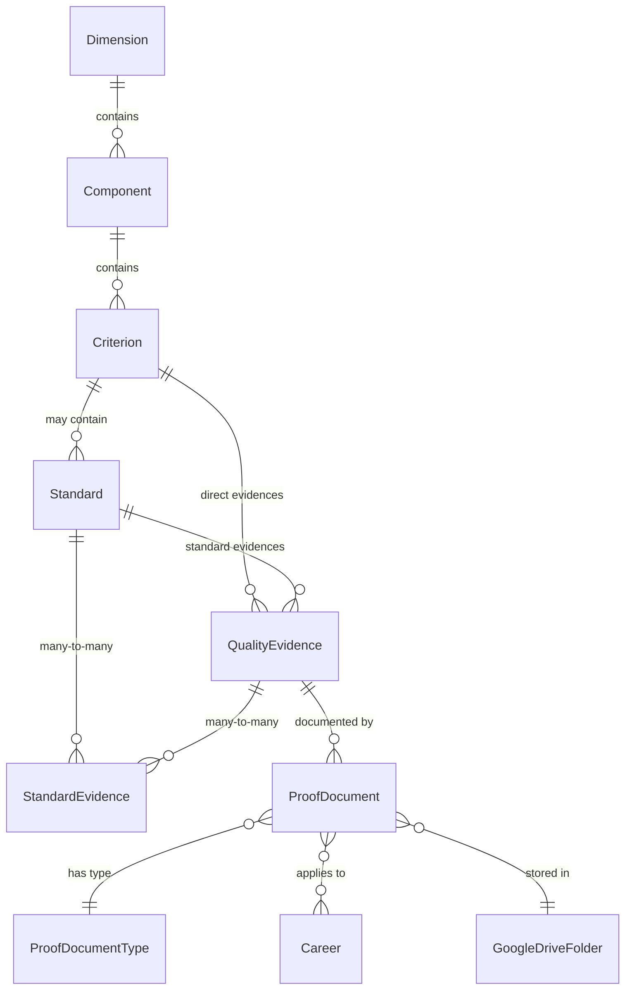
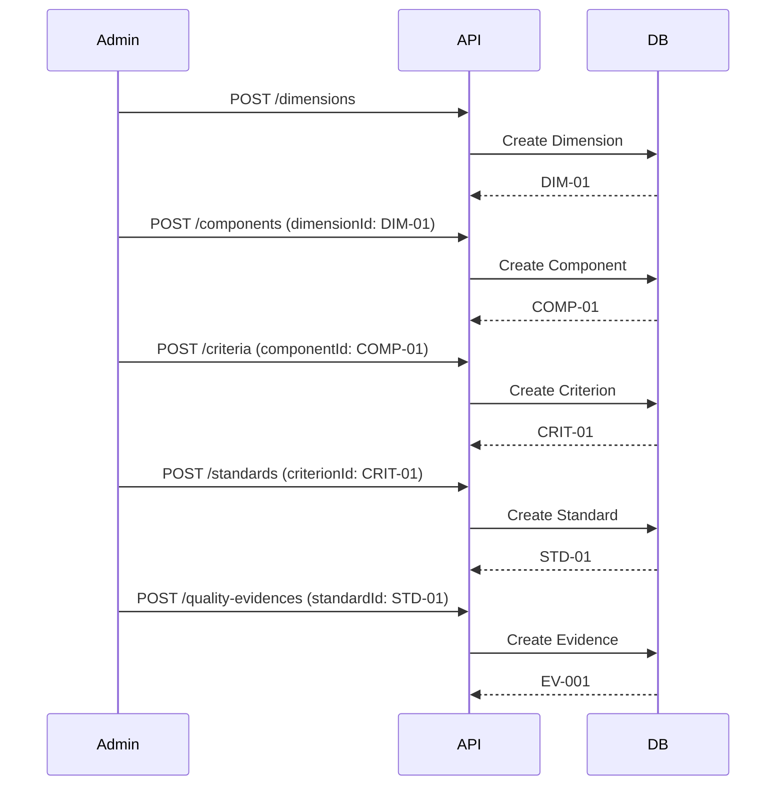
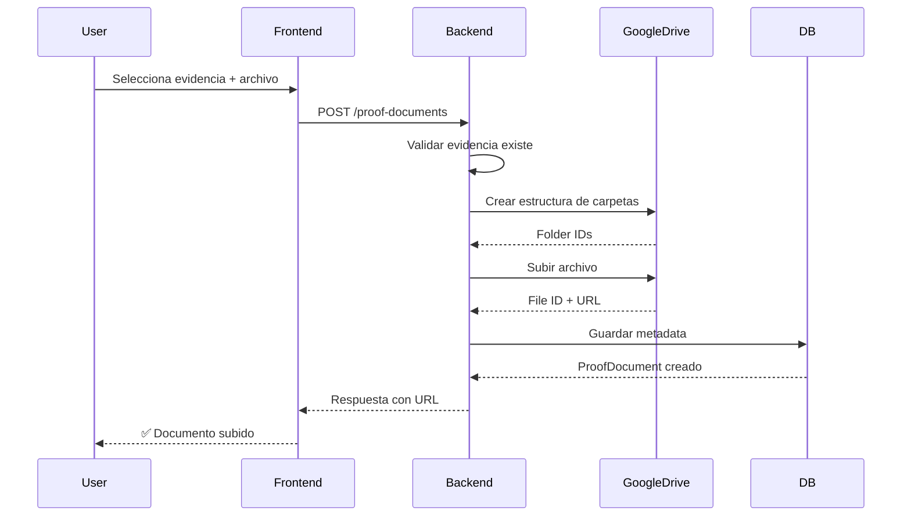

# Módulo SINAES - Sistema de Acreditación

## 📋 Índice

1. [Introducción](#introducción)
2. [Arquitectura del Módulo](#arquitectura-del-módulo)
3. [Modelo de Datos](#modelo-de-datos)
4. [Jerarquía SINAES](#jerarquía-sinaes)
5. [Relaciones entre Entidades](#relaciones-entre-entidades)
6. [Endpoints de la API](#endpoints-de-la-api)
7. [Reglas de Negocio](#reglas-de-negocio)
8. [Flujos de Trabajo](#flujos-de-trabajo)
9. [Google Drive Integration](#google-drive-integration)

---

## 🎯 Introducción

El módulo SINAES gestiona la estructura jerárquica del Sistema Nacional de Acreditación de la Educación Superior (SINAES), permitiendo:

- ✅ Organización de la estructura de acreditación en 5 niveles
- ✅ Gestión de evidencias de calidad
- ✅ Asociación de documentos probatorios
- ✅ Integración con Google Drive para almacenamiento
- ✅ Trazabilidad y auditoría completa

---

## 🏗️ Arquitectura del Módulo

### Estructura de Carpetas

```
src/modules/
├── dimensions/           # Nivel 1: Dimensiones
│   ├── dimensions.controller.ts
│   ├── dimensions.service.ts
│   ├── dimensions.repository.ts
│   ├── dimensions.module.ts
│   └── dtos/
│       ├── dimension.dto.ts
│       ├── create-dimension.dto.ts
│       └── update-dimension.dto.ts
│
├── components/           # Nivel 2: Componentes
│   ├── components.controller.ts
│   ├── components.service.ts
│   ├── components.repository.ts
│   └── ...
│
├── criteria/             # Nivel 3: Criterios
│   ├── criteria.controller.ts
│   ├── criteria.service.ts
│   └── ...
│
├── standards/            # Nivel 4: Estándares (opcional)
│   ├── standards.controller.ts
│   ├── standards.service.ts
│   └── ...
│
├── quality-evidences/    # Nivel 5: Evidencias
│   ├── quality-evidences.controller.ts
│   ├── quality-evidences.service.ts
│   └── ...
│
├── standard-evidences/   # Tabla intermedia
│   └── ...
│
└── proof-documents/      # Documentos probatorios
    ├── proof-documents.controller.ts
    ├── proof-documents.service.ts
    └── ...
```

### Patrón de Diseño

Todos los módulos siguen el patrón **Generic Controller/Service/Repository**:

```typescript
// Controller (Hereda de GenericController)
@Controller('dimensions')
export class DimensionsController extends GenericController<
  DimensionDto,
  CreateDimensionDto,
  UpdateDimensionDto
> {
  // Lógica específica aquí
}

// Service (Hereda de GenericService)
export class DimensionsService extends GenericService<
  Dimension,
  DimensionDto,
  CreateDimensionDto,
  UpdateDimensionDto
> {
  // Reglas de negocio específicas
}

// Repository (Hereda de GenericPrismaRepository)
export class DimensionsRepository extends GenericPrismaRepository<
  Dimension,
  Prisma.DimensionCreateInput,
  Prisma.DimensionUpdateInput,
  Prisma.DimensionWhereUniqueInput
> {
  // Queries específicas
}
```

**Ver más en:** [GENERIC-CONTROLLERS-SERVICES.md](./GENERIC-CONTROLLERS-SERVICES.md)

---

## 📊 Modelo de Datos

### Diagrama de Entidades



### Entidades Base

Todas las entidades SINAES comparten campos comunes:

```typescript
// Campos comunes en todas las entidades
{
  id: string              // ObjectId de MongoDB
  code: string            // Código único (DIM-01, COMP-01, etc.)
  name: string            // Nombre descriptivo
  description: string     // Descripción detallada
  order: number           // Orden de visualización
  status: Status          // ACTIVE | INACTIVE | ARCHIVED
  
  // Auditoría
  createdAt: DateTime
  updatedAt: DateTime
  createdBy?: string
  updatedBy?: string
}
```

### 1. Dimension (Dimensión)

**Tabla:** `dimensions`

```prisma
model Dimension {
  id          String   @id @default(auto()) @map("_id") @db.ObjectId
  code        String   @unique  // Ejemplo: "DIM-01"
  name        String            // "Información y Análisis"
  description String
  order       Int
  status      Status   @default(ACTIVE)
  
  // Relaciones
  components  Component[]
  
  // Auditoría
  createdAt   DateTime @default(now())
  updatedAt   DateTime @updatedAt
  createdBy   String?  @db.ObjectId
  updatedBy   String?  @db.ObjectId
  
  @@map("dimensions")
}
```

**Ejemplo de datos:**
```json
{
  "code": "DIM-01",
  "name": "Información y Análisis",
  "description": "Dimensión que evalúa los procesos de recolección y análisis de información",
  "order": 1,
  "status": "ACTIVE"
}
```

**Nota:** El campo `code` se genera automáticamente en el frontend con el formato `DIM-01`, `DIM-02`, etc.

---

### 2. Component (Componente)

**Tabla:** `components`

```prisma
model Component {
  id          String    @id @default(auto()) @map("_id") @db.ObjectId
  code        String    @unique  // Ejemplo: "COMP-01"
  name        String
  description String
  order       Int
  dimensionId String    @db.ObjectId
  status      Status    @default(ACTIVE)
  
  // Relaciones
  dimension   Dimension @relation(fields: [dimensionId], references: [id])
  criteria    Criterion[]
  
  // Auditoría
  createdAt   DateTime  @default(now())
  updatedAt   DateTime  @updatedAt
  createdBy   String?   @db.ObjectId
  updatedBy   String?   @db.ObjectId
  
  @@map("components")
}
```

**Validaciones:**
- ✅ `dimensionId` debe existir
- ✅ `code` debe ser único
- ✅ No se puede eliminar si tiene criterios asociados

---

### 3. Criterion (Criterio)

**Tabla:** `criteria`

```prisma
model Criterion {
  id          String    @id @default(auto()) @map("_id") @db.ObjectId
  code        String    @unique
  name        String
  description String
  order       Int
  componentId String    @db.ObjectId
  status      Status    @default(ACTIVE)
  
  // Relaciones
  component        Component         @relation(fields: [componentId], references: [id])
  standards        Standard[]        // Opcional: puede tener estándares
  qualityEvidences QualityEvidence[] // Evidencias directas (cuando no hay estándares)
  
  // Auditoría
  createdAt   DateTime @default(now())
  updatedAt   DateTime @updatedAt
  createdBy   String?  @db.ObjectId
  updatedBy   String?  @db.ObjectId
  
  @@map("criteria")
}
```

**Regla de Negocio Importante:**
- Un criterio puede tener **estándares** O **evidencias directas**, no ambos
- Si tiene estándares, las evidencias se asocian a los estándares
- Si NO tiene estándares, las evidencias se asocian directamente al criterio

---

### 4. Standard (Estándar)

**Tabla:** `standards`

```prisma
model Standard {
  id          String    @id @default(auto()) @map("_id") @db.ObjectId
  code        String    @unique
  name        String
  description String
  order       Int
  criterionId String    @db.ObjectId
  status      Status    @default(ACTIVE)
  
  // Relaciones
  criterion         Criterion          @relation(fields: [criterionId], references: [id])
  qualityEvidences  QualityEvidence[]  // Relación directa (legacy)
  standardEvidences StandardEvidence[] // Tabla intermedia many-to-many
  
  // Auditoría
  createdAt   DateTime @default(now())
  updatedAt   DateTime @updatedAt
  createdBy   String?  @db.ObjectId
  updatedBy   String?  @db.ObjectId
  
  @@map("standards")
}
```

**Nota:** Los estándares son **opcionales**. Un criterio puede tener evidencias directamente sin estándares.

---

### 5. QualityEvidence (Evidencia de Calidad)

**Tabla:** `quality_evidences`

```prisma
model QualityEvidence {
  id          String    @id @default(auto()) @map("_id") @db.ObjectId
  code        String    @unique  // Ejemplo: "EV-001"
  name        String
  description String
  order       Int
  
  // Relaciones opcionales (una u otra, no ambas)
  standardId  String?   @db.ObjectId  // Si pertenece a un estándar
  criterionId String?   @db.ObjectId  // Si es evidencia directa del criterio
  
  status      Status    @default(ACTIVE)
  
  // Relaciones
  standard          Standard?          @relation(fields: [standardId], references: [id])
  criterion         Criterion?         @relation(fields: [criterionId], references: [id])
  proofDocuments    ProofDocument[]
  standardEvidences StandardEvidence[] // Many-to-many con estándares
  
  // Auditoría
  createdAt   DateTime @default(now())
  updatedAt   DateTime @updatedAt
  createdBy   String?  @db.ObjectId
  updatedBy   String?  @db.ObjectId
  
  @@map("quality_evidences")
}
```

**Reglas:**
- ✅ `standardId` OR `criterionId` debe estar presente (no ambos)
- ✅ Una evidencia puede estar asociada a **múltiples estándares** vía `StandardEvidence`
- ✅ Si está en múltiples estándares, puede estar en diferentes dimensiones/componentes

---

### 6. StandardEvidence (Tabla Intermedia)

**Tabla:** `standard_evidences`

```prisma
model StandardEvidence {
  id         String   @id @default(auto()) @map("_id") @db.ObjectId
  standardId String   @db.ObjectId
  evidenceId String   @db.ObjectId
  
  // Relaciones
  standard Standard        @relation(fields: [standardId], references: [id])
  evidence QualityEvidence @relation(fields: [evidenceId], references: [id])
  
  // Auditoría
  createdAt  DateTime @default(now())
  updatedAt  DateTime @updatedAt
  createdBy  String?  @db.ObjectId
  updatedBy  String?  @db.ObjectId
  
  @@unique([standardId, evidenceId])
  @@map("standard_evidences")
}
```

**Propósito:** Permite que una evidencia esté asociada a múltiples estándares (relación many-to-many).

---

### 7. ProofDocument (Documento Probatorio)

**Tabla:** `proof_documents`

```prisma
model ProofDocument {
  id                    String   @id @default(auto()) @map("_id") @db.ObjectId
  name                  String
  description           String?
  
  // Relación con evidencia
  evidenceId            String   @db.ObjectId
  
  // Tipo de documento
  proofDocumentTypeId   String   @db.ObjectId
  
  // Google Drive
  googleDriveFileId     String?
  googleDriveFolderId   String?
  fileUrl               String?
  fileName              String?
  fileType              String?
  fileSize              Int?
  
  status                Status   @default(ACTIVE)
  
  // Relaciones
  evidence              QualityEvidence    @relation(fields: [evidenceId], references: [id])
  proofDocumentType     ProofDocumentType  @relation(fields: [proofDocumentTypeId], references: [id])
  careerProofDocuments  CareerProofDocument[]
  
  // Auditoría
  createdAt             DateTime @default(now())
  updatedAt             DateTime @updatedAt
  createdBy             String?  @db.ObjectId
  updatedBy             String?  @db.ObjectId
  
  @@map("proof_documents")
}
```

**Campos importantes:**
- `evidenceId`: Evidencia a la que pertenece
- `googleDriveFileId`: ID del archivo en Google Drive
- `fileUrl`: URL pública del archivo
- `fileName`, `fileType`, `fileSize`: Metadata del archivo

---

## 🔗 Jerarquía SINAES

### Estructura Completa

```
📁 Dimensión (DIM-01)
  │
  ├─ 📁 Componente (COMP-01)
  │   │
  │   ├─ 📁 Criterio (CRIT-01)
  │   │   │
  │   │   ├─ OPCIÓN 1: Sin Estándares
  │   │   │   │
  │   │   │   ├─ 📄 Evidencia Directa (EV-001)
  │   │   │   ├─ 📄 Evidencia Directa (EV-002)
  │   │   │   └─ 📄 Evidencia Directa (EV-003)
  │   │   │
  │   │   └─ OPCIÓN 2: Con Estándares
  │   │       │
  │   │       ├─ 📋 Estándar (STD-01)
  │   │       │   ├─ 📄 Evidencia (EV-001)
  │   │       │   └─ 📄 Evidencia (EV-002)
  │   │       │
  │   │       └─ 📋 Estándar (STD-02)
  │   │           ├─ 📄 Evidencia (EV-003)
  │   │           └─ 📄 Evidencia (EV-001) ← Puede repetirse
  │   │
  │   └─ 📁 Criterio (CRIT-02)
  │
  └─ 📁 Componente (COMP-02)
```

### Rutas de Navegación

**Ejemplo 1: Con Estándares**
```
Dimensión → Componente → Criterio → Estándar → Evidencia
DIM-01 → COMP-01 → CRIT-01 → STD-01 → EV-001
```

**Ejemplo 2: Sin Estándares (Evidencias Directas)**
```
Dimensión → Componente → Criterio → Evidencia
DIM-01 → COMP-01 → CRIT-02 → EV-005
```

---

## 🔄 Relaciones entre Entidades

### 1. Relaciones Uno a Muchos (1:N)

```typescript
Dimension (1) ──→ (N) Component
Component (1) ──→ (N) Criterion
Criterion (1) ──→ (N) Standard      // Opcional
Criterion (1) ──→ (N) QualityEvidence  // Solo si NO tiene estándares
Standard  (1) ──→ (N) QualityEvidence  // Solo si el criterio tiene estándares
QualityEvidence (1) ──→ (N) ProofDocument
```

### 2. Relaciones Muchos a Muchos (N:M)

```typescript
Standard (N) ←──→ (M) QualityEvidence
// Tabla intermedia: StandardEvidence
```

**Permite:** Una evidencia estar en múltiples estándares, componentes o dimensiones.

### 3. Relaciones con Carreras

```typescript
ProofDocument (N) ←──→ (M) Career
// Tabla intermedia: CareerProofDocument
```

**Permite:** Un documento probatorio afectar a múltiples carreras.

---

## 🔌 Endpoints de la API

### Estructura Base de Rutas

Todos los módulos siguen el patrón RESTful estándar:

```
/api/v1/{resource}
```

### 1. Dimensions

| Método | Ruta | Descripción |
|--------|------|-------------|
| GET | `/api/v1/dimensions` | Listar dimensiones (paginado) |
| GET | `/api/v1/dimensions/:id` | Obtener dimensión por ID |
| POST | `/api/v1/dimensions` | Crear nueva dimensión |
| PUT | `/api/v1/dimensions/:id` | Actualizar dimensión |
| DELETE | `/api/v1/dimensions/:id` | Eliminar dimensión |

**Query Params:**
- `page`: Número de página (default: 1)
- `limit`: Items por página (default: 10)
- `status`: Filtrar por estado (ACTIVE, INACTIVE, ARCHIVED)
- `orderBy`: Campo para ordenar (default: order)

**Ejemplo de respuesta:**
```json
{
  "data": [
    {
      "id": "507f1f77bcf86cd799439011",
      "code": "DIM-01",
      "name": "Información y Análisis",
      "description": "...",
      "order": 1,
      "status": "ACTIVE",
      "createdAt": "2024-01-01T00:00:00.000Z",
      "updatedAt": "2024-01-01T00:00:00.000Z"
    }
  ],
  "meta": {
    "total": 5,
    "page": 1,
    "limit": 10,
    "pageCount": 1
  }
}
```

---

### 2. Components

| Método | Ruta | Descripción |
|--------|------|-------------|
| GET | `/api/v1/components` | Listar componentes |
| GET | `/api/v1/components?dimensionId=xxx` | Filtrar por dimensión |
| GET | `/api/v1/components/:id` | Obtener componente |
| POST | `/api/v1/components` | Crear componente |
| PUT | `/api/v1/components/:id` | Actualizar componente |
| DELETE | `/api/v1/components/:id` | Eliminar componente |

---

### 3. Criteria

| Método | Ruta | Descripción |
|--------|------|-------------|
| GET | `/api/v1/criteria` | Listar criterios |
| GET | `/api/v1/criteria?componentId=xxx` | Filtrar por componente |
| GET | `/api/v1/criteria/:id` | Obtener criterio |
| POST | `/api/v1/criteria` | Crear criterio |
| PUT | `/api/v1/criteria/:id` | Actualizar criterio |
| DELETE | `/api/v1/criteria/:id` | Eliminar criterio |

---

### 4. Standards

| Método | Ruta | Descripción |
|--------|------|-------------|
| GET | `/api/v1/standards` | Listar estándares |
| GET | `/api/v1/standards?criterionId=xxx` | Filtrar por criterio |
| GET | `/api/v1/standards/:id` | Obtener estándar |
| POST | `/api/v1/standards` | Crear estándar |
| PUT | `/api/v1/standards/:id` | Actualizar estándar |
| DELETE | `/api/v1/standards/:id` | Eliminar estándar |

---

### 5. Quality Evidences

| Método | Ruta | Descripción |
|--------|------|-------------|
| GET | `/api/v1/quality-evidences` | Listar evidencias |
| GET | `/api/v1/quality-evidences?standardId=xxx` | Filtrar por estándar |
| GET | `/api/v1/quality-evidences?criterionId=xxx` | Filtrar por criterio |
| GET | `/api/v1/quality-evidences/:id` | Obtener evidencia |
| POST | `/api/v1/quality-evidences` | Crear evidencia |
| PUT | `/api/v1/quality-evidences/:id` | Actualizar evidencia |
| DELETE | `/api/v1/quality-evidences/:id` | Eliminar evidencia |

---

### 6. Proof Documents

| Método | Ruta | Descripción |
|--------|------|-------------|
| GET | `/api/v1/proof-documents` | Listar documentos |
| GET | `/api/v1/proof-documents?evidenceId=xxx` | Filtrar por evidencia |
| GET | `/api/v1/proof-documents/:id` | Obtener documento |
| POST | `/api/v1/proof-documents` | Crear documento |
| PUT | `/api/v1/proof-documents/:id` | Actualizar documento |
| DELETE | `/api/v1/proof-documents/:id` | Eliminar documento |

---

## 📋 Reglas de Negocio

### 1. Códigos Únicos Auto-generados

Cada entidad tiene un código único que se genera automáticamente:

```typescript
// Formato: {PREFIX}-{NUMBER}
Dimension:       "DIM-01", "DIM-02", "DIM-03"...      (2 dígitos)
Component:       "COMP-01", "COMP-02", "COMP-03"...   (2 dígitos)
Criterion:       "CRIT-01", "CRIT-02", "CRIT-03"...   (2 dígitos)
Standard:        "STD-01", "STD-02", "STD-03"...      (2 dígitos)
QualityEvidence: "EV-001", "EV-002", "EV-003"...      (3 dígitos, global)
```

**Características:**
- ✅ Generación automática en el frontend
- ✅ Prefijos únicos por tipo de entidad
- ✅ Padding con ceros (01, 02, 001, 002)
- ✅ Las evidencias usan 3 dígitos (pueden ser muchas)
- ✅ Numeración independiente por tipo de entidad

**Implementación:** Ver `auto-numbering.service.ts` en frontend

---

### 2. Validación de Jerarquía

```typescript
// Al crear un Component
✅ dimensionId DEBE existir
✅ dimensionId.status DEBE ser ACTIVE

// Al crear un Criterion
✅ componentId DEBE existir
✅ componentId.status DEBE ser ACTIVE

// Al crear un Standard
✅ criterionId DEBE existir
✅ criterionId.status DEBE ser ACTIVE

// Al crear una QualityEvidence
✅ standardId OR criterionId DEBE existir (no ambos)
✅ El padre debe estar ACTIVE
```

---

### 3. Restricciones de Eliminación

```typescript
// No se puede eliminar si tiene hijos activos
❌ Dimension   → si tiene Components activos
❌ Component   → si tiene Criteria activos
❌ Criterion   → si tiene Standards o Evidences activos
❌ Standard    → si tiene QualityEvidences activos
❌ Evidence    → si tiene ProofDocuments activos
```

**Solución:** Cambiar estado a `INACTIVE` en lugar de eliminar.

---

### 4. Evidencias: Criterio vs Estándar

```typescript
// REGLA: Una evidencia pertenece a:
if (criterion.standards.length > 0) {
  // El criterio TIENE estándares
  evidence.standardId = "xxx"  // ✅
  evidence.criterionId = null  // ✅
} else {
  // El criterio NO tiene estándares (evidencias directas)
  evidence.criterionId = "xxx" // ✅
  evidence.standardId = null   // ✅
}
```

---

### 5. Documentos Probatorios y Carreras

```typescript
// Un documento puede estar asociado a múltiples carreras
ProofDocument → CareerProofDocument → Career

// Al crear un documento:
await proofDocumentService.create({
  name: "Convenio con Universidad X",
  evidenceId: "xxx",
  careerIds: ["careerA", "careerB", "careerC"] // Múltiples carreras
})
```

---

## 🔄 Flujos de Trabajo

### Flujo 1: Crear Estructura Completa



---

### Flujo 2: Subir Documento Probatorio



**Estructura en Google Drive:**
```
📁 Carrera/
  📁 Dimensión/
    📁 Componente/
      📁 Criterio/
        📁 Estándar/
          📁 Evidencia/
            📄 documento.pdf
```

---

### Flujo 3: Consultar Jerarquía Completa

```typescript
// Frontend: Obtener jerarquía completa para una evidencia
const evidence = await fetch('/api/v1/quality-evidences/EV-001?include=full')

// Respuesta incluye toda la jerarquía:
{
  "id": "EV-001",
  "code": "EV-001",
  "name": "Convenios Internacionales",
  "standard": {
    "id": "STD-01",
    "code": "STD-01",
    "name": "Gestión de Convenios",
    "criterion": {
      "id": "CRIT-01",
      "code": "CRIT-01",
      "name": "Relaciones Internacionales",
      "component": {
        "id": "COMP-01",
        "code": "COMP-01",
        "name": "Gestión Institucional",
        "dimension": {
          "id": "DIM-01",
          "code": "DIM-01",
          "name": "Información y Análisis"
        }
      }
    }
  }
}
```

---

## 🔐 Google Drive Integration

### Configuración

Ver documentación completa en: [GOOGLE-DRIVE-OAUTH2-SOLUTION.md](./GOOGLE-DRIVE-OAUTH2-SOLUTION.md)

### Endpoints

| Método | Ruta | Descripción |
|--------|------|-------------|
| POST | `/api/v1/google-drive/create-structure` | Crear estructura de carpetas |
| POST | `/api/v1/google-drive/upload` | Subir archivo |
| DELETE | `/api/v1/google-drive/:fileId` | Eliminar archivo |
| GET | `/api/v1/google-drive/folder/:folderId/files` | Listar archivos |

### Autenticación

```typescript
// El usuario debe autenticarse con Google OAuth2
// El token se guarda en la sesión del usuario
// Solo usuarios con rol ADMIN pueden usar Google Drive
```

**Requisitos:**
- ✅ Usuario autenticado
- ✅ Rol ADMIN
- ✅ Token de Google válido en sesión

---

## 🎯 Casos de Uso

### Caso 1: Crear Dimensión con Componentes

```typescript
// 1. Crear dimensión
const dimension = await dimensionsService.create({
  code: "DIM-01",  // Generado automáticamente en frontend
  name: "Información y Análisis",
  description: "Dimensión que evalúa...",
  order: 1
})
// Resultado: code = "DIM-01" (auto-generado por el servicio de numeración)

// 2. Crear componentes
const comp1 = await componentsService.create({
  code: "COMP-01",  // Generado automáticamente en frontend
  name: "Gestión de la Información",
  dimensionId: dimension.id,
  order: 1
})
// Resultado: code = "COMP-01"

const comp2 = await componentsService.create({
  code: "COMP-02",  // Generado automáticamente en frontend
  name: "Análisis de Datos",
  dimensionId: dimension.id,
  order: 2
})
// Resultado: code = "COMP-02"
```

---

### Caso 2: Criterio con Evidencias Directas (sin estándares)

```typescript
// 1. Crear criterio
const criterion = await criteriaService.create({
  name: "Disponibilidad de Información",
  componentId: component.id,
  order: 1
})

// 2. Crear evidencias directas
const evidence1 = await qualityEvidencesService.create({
  name: "Informes mensuales",
  criterionId: criterion.id,  // ✅ Evidencia directa
  standardId: null              // ✅ No hay estándar
})

const evidence2 = await qualityEvidencesService.create({
  name: "Dashboard de indicadores",
  criterionId: criterion.id
})
```

---

### Caso 3: Criterio con Estándares y Evidencias

```typescript
// 1. Crear criterio
const criterion = await criteriaService.create({
  name: "Gestión de Convenios",
  componentId: component.id,
  order: 1
})

// 2. Crear estándares
const standard1 = await standardsService.create({
  name: "Convenios Internacionales",
  criterionId: criterion.id
})

const standard2 = await standardsService.create({
  name: "Convenios Nacionales",
  criterionId: criterion.id
})

// 3. Crear evidencias asociadas a estándares
const evidence1 = await qualityEvidencesService.create({
  name: "Listado de convenios vigentes",
  standardId: standard1.id,     // ✅ Pertenece a estándar
  criterionId: null             // ✅ No es evidencia directa
})

// 4. Evidencia compartida entre estándares
const evidence2 = await qualityEvidencesService.create({
  name: "Procedimiento de gestión",
  standardId: standard1.id
})

// Asociar la misma evidencia al segundo estándar
await standardEvidencesService.create({
  standardId: standard2.id,
  evidenceId: evidence2.id
})
// Ahora evidence2 está en ambos estándares
```

---

### Caso 4: Subir Documento Probatorio

```typescript
// 1. Usuario selecciona evidencia y sube archivo
const proofDocument = await proofDocumentsService.create({
  name: "Convenio con Universidad de Costa Rica",
  description: "Convenio marco de colaboración",
  evidenceId: "EV-001",
  proofDocumentTypeId: "TYPE-001",
  file: uploadedFile,
  careerIds: ["CAR-001", "CAR-002"] // Múltiples carreras
})

// 2. El servicio automáticamente:
// - Crea la estructura de carpetas en Google Drive
// - Sube el archivo
// - Guarda metadata en la BD
// - Asocia con carreras

// Resultado:
{
  "id": "PROOF-001",
  "name": "Convenio con Universidad de Costa Rica",
  "fileUrl": "https://drive.google.com/file/d/...",
  "googleDriveFileId": "1ABC...",
  "fileName": "convenio-ucr.pdf",
  "fileSize": 2048576,
  "fileType": "application/pdf"
}
```

---

## 📝 Notas Importantes

### Performance

1. **Índices de BD:**
   ```typescript
   // Todos los códigos están indexados (unique)
   @@index([code])
   
   // Índices en foreign keys
   @@index([dimensionId])
   @@index([componentId])
   @@index([criterionId])
   @@index([standardId])
   @@index([evidenceId])
   ```

2. **Paginación:**
   - Todos los endpoints de listado están paginados
   - Default: 10 items por página
   - Máximo: 100 items por página

3. **Caché:**
   - Las dimensiones se cachean (rara vez cambian)
   - Los documentos NO se cachean (frecuentemente cambian)

---

### Seguridad

1. **Autenticación:**
   ```typescript
   // Todos los endpoints requieren autenticación
   @UseGuards(JwtAuthGuard)
   ```

2. **Autorización:**
   ```typescript
   // Solo ADMIN puede modificar estructura SINAES
   @Roles('ADMIN')
   @UseGuards(RolesGuard)
   ```

3. **Validación:**
   ```typescript
   // Todos los DTOs usan class-validator
   @IsString()
   @IsNotEmpty()
   name: string
   ```

---

### Auditoría

Todos los cambios se registran automáticamente:

```typescript
{
  createdAt: DateTime,  // Cuándo se creó
  updatedAt: DateTime,  // Última modificación
  createdBy: string,    // ID del usuario que creó
  updatedBy: string     // ID del usuario que modificó
}
```

---

## 🚀 Próximas Mejoras

1. **Versionado:** Historial de cambios en la estructura
2. **Reportes:** Generar reportes de cumplimiento
3. **Notificaciones:** Alertas cuando falten documentos
4. **Búsqueda:** Full-text search en documentos
5. **Analytics:** Dashboard de métricas de acreditación

---

## 📚 Referencias

- [Documentación SINAES Costa Rica](https://www.sinaes.ac.cr/)
- [Generic Controllers Pattern](./GENERIC-CONTROLLERS-SERVICES.md)
- [Google Drive Integration](./GOOGLE-DRIVE-OAUTH2-SOLUTION.md)
- [Auth Module](./AUTH-MODULE.md)
- [Prisma Schema](../../packages/database/prisma/schema/)

---

**Última actualización:** Octubre 2025  
**Versión:** 1.0.0  
**Mantenedor:** Sistema de Gestión de Calidad - UNA
