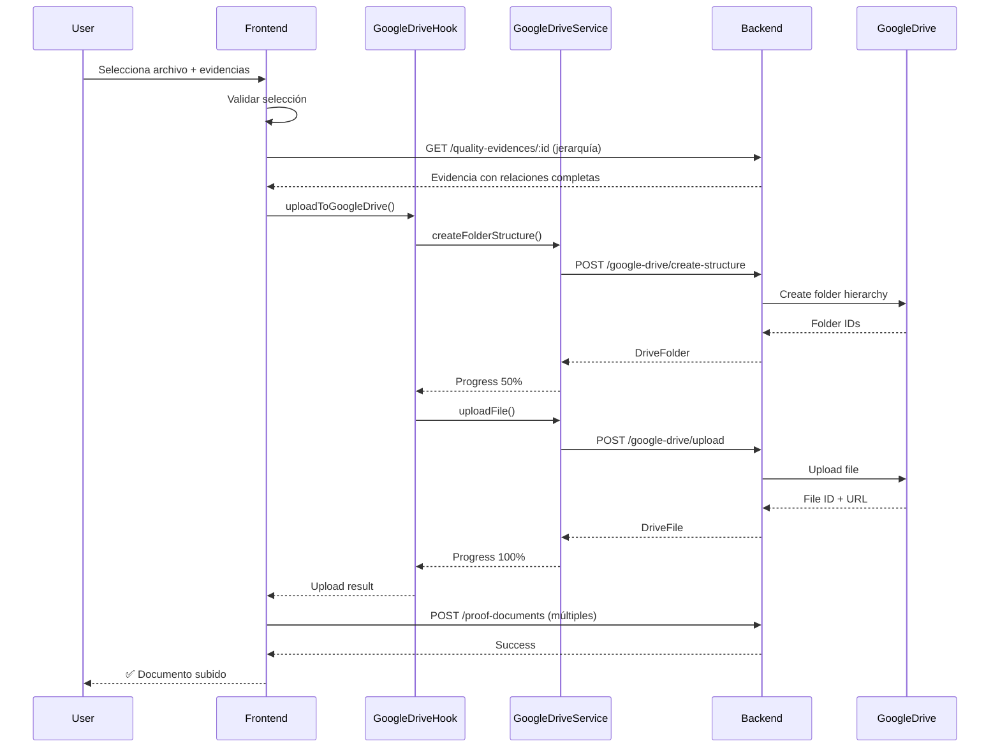

# Módulo SINAES - Frontend (React/Next.js)

## 📋 Índice

1. [Introducción](#introducción)
2. [Arquitectura del Módulo](#arquitectura-del-módulo)
3. [Estructura de Carpetas](#estructura-de-carpetas)
4. [State Management](#state-management)
5. [Componentes Principales](#componentes-principales)
6. [Servicios y API](#servicios-y-api)
7. [Hooks Personalizados](#hooks-personalizados)
8. [Formularios](#formularios)
9. [Google Drive Integration](#google-drive-integration)
10. [Flujos de Usuario](#flujos-de-usuario)
11. [Patrones de Diseño](#patrones-de-diseño)
12. [Mejores Prácticas](#mejores-prácticas)

---

## 🎯 Introducción

El módulo SINAES frontend proporciona una interfaz completa para gestionar la estructura jerárquica del Sistema Nacional de Acreditación de la Educación Superior (SINAES).

### Características Principales

- ✅ **Navegación Jerárquica:** 5 niveles de navegación (Dimensión → Componente → Criterio → Estándar → Evidencia)
- ✅ **CRUD Completo:** Crear, leer, actualizar y eliminar entidades
- ✅ **Subida de Documentos:** Integración con Google Drive
- ✅ **Auto-numeración:** Códigos únicos generados automáticamente
- ✅ **UI Responsiva:** Scroll horizontal para ventanas pequeñas
- ✅ **Validación en Tiempo Real:** Feedback inmediato al usuario
- ✅ **Estado Global:** Gestión de selecciones con Zustand

### Stack Tecnológico

```typescript
// Framework & Core
- Next.js 15.3.4 (App Router)
- React 19
- TypeScript 5.x

// UI Components
- shadcn/ui (Radix UI)
- Tailwind CSS
- Lucide Icons

// State Management
- Zustand 4.x (Global state)
- TanStack Query v5 (Server state)

// HTTP Client
- Axios (custom HttpClient wrapper)

// Validation
- Zod (Schema validation)

// Notifications
- Sonner (Toast notifications)
```

---

## 🏗️ Arquitectura del Módulo

### Diagrama de Arquitectura

```
┌─────────────────────────────────────────────────────────┐
│                      UI Layer                            │
│  ┌──────────────┐  ┌──────────────┐  ┌──────────────┐  │
│  │   Pages      │  │  Components  │  │    Forms     │  │
│  └──────────────┘  └──────────────┘  └──────────────┘  │
└───────────────────────┬─────────────────────────────────┘
                        │
┌───────────────────────┼─────────────────────────────────┐
│              State Management Layer                      │
│  ┌──────────────┐  ┌──────────────┐  ┌──────────────┐  │
│  │   Zustand    │  │ TanStack     │  │    Local     │  │
│  │   Stores     │  │   Query      │  │    State     │  │
│  └──────────────┘  └──────────────┘  └──────────────┘  │
└───────────────────────┬─────────────────────────────────┘
                        │
┌───────────────────────┼─────────────────────────────────┐
│                 Service Layer                            │
│  ┌──────────────┐  ┌──────────────┐  ┌──────────────┐  │
│  │   Generic    │  │    SINAES    │  │  Google      │  │
│  │   Services   │  │   Services   │  │  Drive       │  │
│  └──────────────┘  └──────────────┘  └──────────────┘  │
└───────────────────────┬─────────────────────────────────┘
                        │
┌───────────────────────┼─────────────────────────────────┐
│                  API Layer                               │
│  ┌──────────────┐  ┌──────────────┐  ┌──────────────┐  │
│  │   HttpClient │  │  Auth        │  │   Error      │  │
│  │   (Axios)    │  │  Interceptor │  │   Handler    │  │
│  └──────────────┘  └──────────────┘  └──────────────┘  │
└───────────────────────┬─────────────────────────────────┘
                        │
                   Backend API
              (NestJS on port 3000)
```

---

## 📁 Estructura de Carpetas

```
src/modules/sinaes-management/
│
├── components/                    # Componentes del módulo
│   ├── admin/                     # Componentes de administración
│   │   ├── auto-numbering-test-suite.tsx
│   │   ├── recalculate-codes-admin.tsx
│   │   └── index.ts
│   │
│   ├── forms/                     # Formularios CRUD
│   │   ├── dimension-form.tsx
│   │   ├── component-form.tsx
│   │   ├── criterion-form.tsx
│   │   ├── standard-form.tsx
│   │   ├── quality-evidence-form.tsx
│   │   └── proof-document-type-form.tsx
│   │
│   ├── structure/                 # Componentes de navegación
│   │   ├── panels/               # Paneles laterales
│   │   │   ├── dimensions-panel.tsx
│   │   │   ├── components-panel.tsx
│   │   │   ├── criteria-panel.tsx
│   │   │   ├── standards-panel.tsx
│   │   │   └── quality-evidences-panel.tsx
│   │   │
│   │   ├── dimensions-list.tsx
│   │   ├── components-list.tsx
│   │   ├── criteria-list.tsx
│   │   ├── standards-list.tsx
│   │   ├── quality-evidences-list.tsx
│   │   ├── content-area.tsx
│   │   ├── hierarchy-navigator.tsx
│   │   └── sinaes-structure-tab.tsx
│   │
│   ├── upload/                    # Subida de documentos
│   │   └── simple-proof-document-form.tsx
│   │
│   ├── document-types/            # Tipos de documentos
│   │   └── ...
│   │
│   ├── sinaes-management-page.tsx # Página principal
│   ├── upload-documents-tab.tsx   # Tab de subida
│   └── google-auth-banner.tsx     # Banner de autenticación
│
├── services/                      # Servicios API
│   ├── dimensions.service.ts
│   ├── components.service.ts
│   ├── criteria.service.ts
│   ├── standards.service.ts
│   ├── quality-evidences.service.ts
│   ├── proof-documents.service.ts
│   ├── standard-evidences.service.ts
│   ├── career-proof-documents.service.ts
│   ├── proof-document-types.service.ts
│   ├── auto-numbering.service.ts
│   ├── google-drive.service.ts
│   ├── document-upload.service.ts
│   └── integrated-proof-documents.service.ts
│
├── hooks/                         # Custom hooks
│   ├── use-google-drive-upload.ts
│   └── use-auto-numbering.ts
│
├── store/                         # Estado global (Zustand)
│   ├── sinaes-navigation.store.ts
│   └── document-assignment.store.ts
│
├── types/                         # TypeScript types
│   ├── dimensions.types.ts
│   ├── components.types.ts
│   ├── criteria.types.ts
│   ├── standards.types.ts
│   ├── quality-evidences.types.ts
│   └── proof-document-types.types.ts
│
├── utils/                         # Utilidades
│   └── ...
│
└── pages/                         # Páginas del módulo
    └── sinaes-admin.tsx
```

---

## 🗂️ State Management

### 1. Zustand Store - Navigation State

**Archivo:** `store/sinaes-navigation.store.ts`

```typescript
import { create } from 'zustand'

interface SinaesNavigationState {
  selectedDimension: Dimension | null
  selectedComponent: Component | null
  selectedCriterion: Criterion | null
  selectedStandard: Standard | null
  selectedQualityEvidence: QualityEvidence | null
}

interface SinaesNavigationActions {
  selectDimension: (dimension: Dimension | null) => void
  selectComponent: (component: Component | null) => void
  selectCriterion: (criterion: Criterion | null) => void
  selectStandard: (standard: Standard | null) => void
  selectQualityEvidence: (evidence: QualityEvidence | null) => void
  reset: () => void
}

export const useSinaesNavigation = create<SinaesNavigationState & SinaesNavigationActions>()(
  (set) => ({
    // Estado inicial
    selectedDimension: null,
    selectedComponent: null,
    selectedCriterion: null,
    selectedStandard: null,
    selectedQualityEvidence: null,

    // Acciones
    selectDimension: (dimension) =>
      set({
        selectedDimension: dimension,
        selectedComponent: null,
        selectedCriterion: null,
        selectedStandard: null,
        selectedQualityEvidence: null
      }),

    selectComponent: (component) =>
      set((state) => ({
        ...state,
        selectedComponent: component,
        selectedCriterion: null,
        selectedStandard: null,
        selectedQualityEvidence: null
      })),

    selectCriterion: (criterion) =>
      set((state) => ({
        ...state,
        selectedCriterion: criterion,
        selectedStandard: null,
        selectedQualityEvidence: null
      })),

    selectStandard: (standard) =>
      set((state) => ({
        ...state,
        selectedStandard: standard,
        selectedQualityEvidence: null
      })),

    selectQualityEvidence: (evidence) =>
      set((state) => ({
        ...state,
        selectedQualityEvidence: evidence
      })),

    reset: () =>
      set({
        selectedDimension: null,
        selectedComponent: null,
        selectedCriterion: null,
        selectedStandard: null,
        selectedQualityEvidence: null
      })
  })
)
```

**Uso en componentes:**

```tsx
const { selectedDimension, selectDimension } = useSinaesNavigation()

// Seleccionar dimensión
const handleClick = () => {
  selectDimension(dimension)
}
```

---

### 2. TanStack Query - Server State

**Configuración:** Gestión automática de cache, refetch, y estados de carga.

```typescript
import { useQuery, useMutation, useQueryClient } from '@tanstack/react-query'

// Hook para listar dimensiones
export const useDimensions = () => {
  return useQuery({
    queryKey: ['dimensions'],
    queryFn: () => dimensionService.findAll()
  })
}

// Hook para crear dimensión
export const useCreateDimension = () => {
  const queryClient = useQueryClient()

  return useMutation({
    mutationFn: (data: CreateDimensionDto) => dimensionService.create(data),
    onSuccess: () => {
      // Invalida cache para refrescar lista
      queryClient.invalidateQueries({ queryKey: ['dimensions'] })
    }
  })
}
```

---

## 🧩 Componentes Principales

### 1. Página Principal - `sinaes-management-page.tsx`

**Propósito:** Contenedor principal con tabs para estructura y subida de documentos.

```tsx
export const SinaesManagementPage = () => {
  return (
    <div className="container mx-auto p-6">
      <h1 className="text-3xl font-bold mb-6">Gestión SINAES</h1>

      <Tabs defaultValue="structure">
        <TabsList>
          <TabsTrigger value="structure">Estructura SINAES</TabsTrigger>
          <TabsTrigger value="upload">Subir Documentos</TabsTrigger>
        </TabsList>

        <TabsContent value="structure">
          <SinaesStructureTab />
        </TabsContent>

        <TabsContent value="upload">
          <UploadDocumentsTab />
        </TabsContent>
      </Tabs>
    </div>
  )
}
```

---

### 2. Navegación Jerárquica - `sinaes-structure-tab.tsx`

**Propósito:** Layout horizontal con scroll que contiene los 5 paneles de navegación.

```tsx
export const SinaesStructureTab = () => {
  return (
    <div className="w-full h-full overflow-x-auto overflow-y-hidden">
      <div className="flex gap-4" style={{ minWidth: 'max-content' }}>
        <div className="w-64 flex-shrink-0 h-full">
          <DimensionsPanel />
        </div>

        <div className="w-64 flex-shrink-0 h-full">
          <ComponentsPanel />
        </div>

        <div className="w-64 flex-shrink-0 h-full">
          <CriteriaPanel />
        </div>

        <div className="w-64 flex-shrink-0 h-full">
          <StandardsPanel />
        </div>

        <div className="w-64 flex-shrink-0 h-full">
          <QualityEvidencesPanel />
        </div>
      </div>
    </div>
  )
}
```

**Características:**
- ✅ Scroll horizontal para ventanas pequeñas
- ✅ Paneles de ancho fijo (256px cada uno)
- ✅ Altura completa para todos los paneles
- ✅ Gap de 16px entre paneles

---

### 3. Panel de Dimensiones - `dimensions-panel.tsx`

**Propósito:** Listar y gestionar dimensiones (nivel 1 de jerarquía).

```tsx
export const DimensionsPanel = () => {
  const [showCreateModal, setShowCreateModal] = useState(false)
  const [showEditModal, setShowEditModal] = useState(false)
  const [editingDimension, setEditingDimension] = useState<Dimension | null>(null)

  const { data: dimensions, isLoading } = useDimensions()
  const { selectedDimension, selectDimension, reset } = useSinaesNavigation()

  const handleSelectDimension = (dimension: Dimension) => {
    if (selectedDimension?.id === dimension.id) {
      reset() // Deseleccionar si ya está seleccionada
    } else {
      selectDimension(dimension)
    }
  }

  const handleEditDimension = (e: React.MouseEvent, dimension: Dimension) => {
    e.stopPropagation() // Evitar trigger de selección
    setEditingDimension(dimension)
    setShowEditModal(true)
  }

  return (
    <>
      <Card className="h-full flex flex-col">
        <CardHeader className="flex-shrink-0 pb-3">
          <div className="flex items-center justify-between gap-2">
            <CardTitle className="text-base">Dimensiones</CardTitle>
            <Button
              size="sm"
              onClick={() => setShowCreateModal(true)}
              className="flex items-center gap-1 h-8 px-3"
            >
              <Plus className="h-4 w-4" />
              Nueva
            </Button>
          </div>
        </CardHeader>

        <CardContent className="flex-1 overflow-y-auto px-3 pb-3">
          {isLoading ? (
            <div className="flex items-center justify-center h-32">
              <div className="text-sm text-muted-foreground">Cargando...</div>
            </div>
          ) : (
            <div className="space-y-1.5">
              {dimensions?.data?.map((dimension) => (
                <div
                  key={dimension.id}
                  className={cn(
                    "p-2.5 rounded-md border cursor-pointer transition-all",
                    "hover:border-primary",
                    selectedDimension?.id === dimension.id
                      ? "border-primary bg-primary/5"
                      : "border-border hover:bg-muted/50"
                  )}
                  onClick={() => handleSelectDimension(dimension)}
                >
                  <div className="flex items-center justify-between gap-2">
                    <div className="flex-1 min-w-0">
                      <div className="font-medium text-sm">
                        {dimension.code}
                      </div>
                    </div>
                    <Button
                      variant="ghost"
                      size="sm"
                      onClick={(e) => handleEditDimension(e, dimension)}
                      className="h-7 w-7 p-0 flex-shrink-0"
                    >
                      ✏️
                    </Button>
                  </div>
                </div>
              ))}
            </div>
          )}
        </CardContent>
      </Card>

      <DimensionForm
        open={showCreateModal}
        onClose={() => setShowCreateModal(false)}
      />

      <DimensionForm
        open={showEditModal}
        onClose={() => {
          setShowEditModal(false)
          setEditingDimension(null)
        }}
        dimension={editingDimension}
      />
    </>
  )
}
```

**Características:**
- ✅ **Solo muestra código** (no código + nombre) para UI limpia
- ✅ **Botón "Nueva" alineado** con el título (mismo nivel)
- ✅ **Botón de editar** compacto (7x7 con emoji ✏️)
- ✅ **Selección visual** con borde y fondo primario
- ✅ **Deselección** al hacer clic en elemento ya seleccionado
- ✅ **Scroll interno** en el CardContent

**Patrón repetido en:**
- `components-panel.tsx` (Nivel 2)
- `criteria-panel.tsx` (Nivel 3)
- `standards-panel.tsx` (Nivel 4)
- `quality-evidences-panel.tsx` (Nivel 5)

---

### 4. Subida de Documentos - `upload-documents-tab.tsx`

**Propósito:** Formulario para subir documentos probatorios con múltiples evidencias.

```tsx
export const UploadDocumentsTab = () => {
  const [isSubmitting, setIsSubmitting] = useState(false)
  const { uploadToGoogleDrive, isUploading, uploadProgress } = useGoogleDriveUpload()

  const handleSubmit = async (data: any) => {
    setIsSubmitting(true)

    try {
      // Validar evidencias y carreras
      if (!data.evidenceIds || data.evidenceIds.length === 0) {
        toast.error('Debe seleccionar al menos una evidencia SINAES')
        return
      }

      if (!data.careerIds || data.careerIds.length === 0) {
        toast.error('Debe seleccionar al menos una carrera')
        return
      }

      // Obtener jerarquía completa de la primera evidencia
      const firstEvidenceId = data.evidenceIds[0]
      const evidenceResponse = await fetch(
        `${process.env.NEXT_PUBLIC_API_URL}/quality-evidences/${firstEvidenceId}`,
        { credentials: 'include' }
      )

      if (!evidenceResponse.ok) {
        throw new Error('No se pudo obtener la información de la evidencia')
      }

      const evidenceData = await evidenceResponse.json()
      const evidence = evidenceData.data

      // Validar jerarquía completa
      if (!evidence.standard?.criterion?.component?.dimension) {
        throw new Error('La evidencia no tiene la jerarquía completa')
      }

      const standard = evidence.standard
      const criterion = standard.criterion
      const component = criterion.component
      const dimension = component.dimension

      // Obtener información de la carrera
      const firstCareerId = data.careerIds[0]
      const careerResponse = await fetch(
        `${process.env.NEXT_PUBLIC_API_URL}/careers/${firstCareerId}`,
        { credentials: 'include' }
      )

      if (!careerResponse.ok) {
        throw new Error('No se pudo obtener la información de la carrera')
      }

      const careerData = await careerResponse.json()
      const career = careerData.data

      // Subir a Google Drive con estructura de carpetas
      const uploadResult = await uploadToGoogleDrive({
        file: data.file,
        folderStructure: {
          dimensionCode: dimension.code,
          dimensionName: dimension.name,
          componentCode: component.code,
          componentName: component.name,
          criterionCode: criterion.code,
          criterionName: criterion.name,
          standardCode: standard.code,
          standardName: standard.name,
          evidenceCode: evidence.code,
          evidenceName: evidence.name,
          careerCode: career.code,
          careerName: career.name
        }
      })

      if (!uploadResult) {
        throw new Error('No se pudo subir el archivo a Google Drive')
      }

      // Crear registros en BD para CADA evidencia seleccionada
      for (const evidenceId of data.evidenceIds) {
        await proofDocumentService.create({
          name: data.name,
          description: data.description,
          evidenceId: evidenceId,
          proofDocumentTypeId: data.documentTypeId,
          fileUrl: uploadResult.fileUrl,
          fileName: uploadResult.fileName,
          fileType: data.file.type,
          fileSize: data.file.size,
          googleDriveFileId: uploadResult.fileId,
          googleDriveFolderId: uploadResult.folderId,
          careerIds: data.careerIds
        })
      }

      toast.success('Documento subido exitosamente')
    } catch (error) {
      console.error('Error uploading document:', error)
      toast.error('Error al subir documento')
    } finally {
      setIsSubmitting(false)
    }
  }

  return (
    <div className="space-y-4">
      <GoogleAuthBanner />
      <SimpleProofDocumentForm
        onSubmit={handleSubmit}
        isSubmitting={isSubmitting || isUploading}
        uploadProgress={uploadProgress}
      />
    </div>
  )
}
```

**Características:**
- ✅ **Múltiples evidencias:** Un documento puede asociarse a varias evidencias
- ✅ **Múltiples carreras:** Un documento puede aplicar a varias carreras
- ✅ **Jerarquía desde backend:** Obtiene la estructura completa del backend
- ✅ **Progreso de subida:** Muestra progreso visual con porcentaje
- ✅ **Validaciones:** Verifica evidencias, carreras y jerarquía completa

---

## 📝 Formularios

### Patrón de Formulario - `dimension-form.tsx`

Todos los formularios siguen el mismo patrón:

```tsx
interface DimensionFormProps {
  open: boolean
  onClose: () => void
  dimension?: Dimension | null  // Si existe, es edición
  onSuccess?: () => void
}

export const DimensionForm = ({ open, onClose, dimension, onSuccess }: DimensionFormProps) => {
  const [formData, setFormData] = useState<CreateDimensionDto>({
    name: '',
    code: '',
    description: '',
    order: 0
  })

  const createDimension = useCreateDimension()
  const updateDimension = useUpdateDimension()

  // ⚠️ IMPORTANTE: Sincronizar formData cuando cambie dimension
  useEffect(() => {
    if (dimension) {
      setFormData({
        name: dimension.name || '',
        code: dimension.code || '',
        description: dimension.description || '',
        order: dimension.order || 0
      })
    } else {
      // Resetear formulario si no hay dimension (modo crear)
      setFormData({ name: '', code: '', description: '', order: 0 })
    }
  }, [dimension, open])

  const handleSubmit = async (e: React.FormEvent) => {
    e.preventDefault()

    try {
      if (dimension) {
        // Modo edición
        await updateDimension.mutateAsync({
          id: dimension.id,
          data: formData
        })
        toast.success('Dimensión actualizada')
      } else {
        // Modo creación
        await createDimension.mutateAsync(formData)
        toast.success('Dimensión creada')
      }

      onSuccess?.()
      onClose()
    } catch (error) {
      toast.error('Error al guardar dimensión')
    }
  }

  return (
    <Dialog open={open} onOpenChange={onClose}>
      <DialogContent>
        <DialogHeader>
          <DialogTitle>
            {dimension ? 'Editar Dimensión' : 'Nueva Dimensión'}
          </DialogTitle>
        </DialogHeader>

        <form onSubmit={handleSubmit} className="space-y-4">
          <div>
            <Label htmlFor="code">Código</Label>
            <Input
              id="code"
              value={formData.code}
              onChange={(e) => setFormData({ ...formData, code: e.target.value })}
              required
            />
          </div>

          <div>
            <Label htmlFor="name">Nombre</Label>
            <Input
              id="name"
              value={formData.name}
              onChange={(e) => setFormData({ ...formData, name: e.target.value })}
              required
            />
          </div>

          <div>
            <Label htmlFor="description">Descripción</Label>
            <Textarea
              id="description"
              value={formData.description}
              onChange={(e) => setFormData({ ...formData, description: e.target.value })}
            />
          </div>

          <div>
            <Label htmlFor="order">Orden</Label>
            <Input
              id="order"
              type="number"
              value={formData.order}
              onChange={(e) => setFormData({ ...formData, order: parseInt(e.target.value) })}
              required
            />
          </div>

          <div className="flex justify-end gap-2">
            <Button type="button" variant="outline" onClick={onClose}>
              Cancelar
            </Button>
            <Button type="submit" disabled={createDimension.isPending || updateDimension.isPending}>
              {dimension ? 'Actualizar' : 'Crear'}
            </Button>
          </div>
        </form>
      </DialogContent>
    </Dialog>
  )
}
```

**✅ Fix Importante - Sincronización de FormData:**

El `useEffect` es CRÍTICO para que el formulario cargue los datos al editar:

```tsx
useEffect(() => {
  if (dimension) {
    setFormData({...dimension}) // Cargar datos al editar
  } else {
    setFormData({...initialState}) // Resetear al crear
  }
}, [dimension, open]) // ⚠️ Dependencias importantes
```

**Sin este `useEffect`:**
- ❌ Al editar diferentes entidades, el formulario muestra datos viejos
- ❌ Los campos no se actualizan al cambiar de entidad
- ❌ El formulario queda "pegado" con datos anteriores

---

## 🔌 Servicios y API

### 1. Generic Service Pattern

**Archivo:** `@/services/base/generic.service.ts`

```typescript
export class GenericService<T, CreateDto, UpdateDto> {
  constructor(private readonly endpoint: string) {}

  async findAll(params?: Record<string, any>): Promise<PaginatedResponse<T>> {
    const response = await HttpClient.get(`/${this.endpoint}`, { params })
    return response.data
  }

  async findOne(id: string): Promise<T> {
    const response = await HttpClient.get(`/${this.endpoint}/${id}`)
    return response.data.data
  }

  async create(data: CreateDto): Promise<T> {
    const response = await HttpClient.post(`/${this.endpoint}`, data)
    return response.data.data
  }

  async update(id: string, data: UpdateDto): Promise<T> {
    const response = await HttpClient.put(`/${this.endpoint}/${id}`, data)
    return response.data.data
  }

  async delete(id: string): Promise<void> {
    await HttpClient.delete(`/${this.endpoint}/${id}`)
  }
}
```

---

### 2. Dimensions Service

**Archivo:** `services/dimensions.service.ts`

```typescript
import { GenericService } from '@/services/base/generic.service'
import { createGenericHooks } from '@/services/base/generic.hooks'
import type { Dimension, CreateDimensionDto, UpdateDimensionDto } from '../types/dimensions.types'

// Base service instance
export const dimensionService = new GenericService<
  Dimension,
  CreateDimensionDto,
  UpdateDimensionDto
>('dimensions')

// Hooks personalizados
export const {
  useList: useDimensions,
  useOne: useDimension,
  useCreate: useCreateDimension,
  useUpdate: useUpdateDimension,
  useDelete: useDeleteDimension
} = createGenericHooks<Dimension, CreateDimensionDto, UpdateDimensionDto>(
  'dimensions',
  dimensionService
)

// Extended functionality
export const dimensionServiceExtended = {
  async getWithFullHierarchy(): Promise<any[]> {
    const response = await HttpClient.get(
      '/dimensions?include=components.criteria.standards.qualityEvidences'
    )
    return response.data.data || []
  }
}
```

**Uso en componentes:**

```tsx
// Listar dimensiones
const { data: dimensions, isLoading } = useDimensions()

// Obtener una dimensión
const { data: dimension } = useDimension(dimensionId)

// Crear dimensión
const createDimension = useCreateDimension()
await createDimension.mutateAsync(formData)

// Actualizar dimensión
const updateDimension = useUpdateDimension()
await updateDimension.mutateAsync({ id, data: formData })

// Eliminar dimensión
const deleteDimension = useDeleteDimension()
await deleteDimension.mutateAsync(id)
```

---

### 3. Google Drive Service

**Archivo:** `services/google-drive.service.ts`

```typescript
export interface FolderStructure {
  dimensionCode: string
  dimensionName: string
  componentCode: string
  componentName: string
  criterionCode: string
  criterionName: string
  standardCode: string
  standardName: string
  evidenceCode: string
  evidenceName: string
  careerCode: string
  careerName: string
}

export interface DriveFolder {
  id: string
  name: string
  path: string
  level: number
}

export interface DriveFile {
  id: string
  name: string
  url: string
  folderId: string
  size: number
  mimeType: string
}

class GoogleDriveService {
  private basePath = '/google-drive'

  async createFolderStructure(structure: FolderStructure): Promise<DriveFolder> {
    const response = await HttpClient.post(`${this.basePath}/create-structure`, structure)
    return response.data
  }

  async uploadFile(file: File, folderId: string): Promise<DriveFile> {
    const formData = new FormData()
    formData.append('file', file)
    formData.append('folderId', folderId)

    const response = await HttpClient.post(`${this.basePath}/upload`, formData, {
      headers: { 'Content-Type': 'multipart/form-data' }
    })
    return response.data
  }

  async deleteFile(fileId: string): Promise<void> {
    await HttpClient.delete(`${this.basePath}/${fileId}`)
  }
}

export const googleDriveService = new GoogleDriveService()
```

---

## 🪝 Hooks Personalizados

### 1. useGoogleDriveUpload

**Archivo:** `hooks/use-google-drive-upload.ts`

```typescript
export interface GoogleDriveUploadOptions {
  file: File
  folderStructure: FolderStructure
  onSuccess?: (fileId: string, fileUrl: string, folderId: string) => void
  onError?: (error: Error) => void
}

export interface GoogleDriveUploadResult {
  fileId: string
  fileUrl: string
  folderId: string
  fileName: string
  fileSize: number
  mimeType: string
}

export function useGoogleDriveUpload() {
  const [isUploading, setIsUploading] = useState(false)
  const [uploadProgress, setUploadProgress] = useState(0)
  const [error, setError] = useState<Error | null>(null)

  const uploadToGoogleDrive = async (
    options: GoogleDriveUploadOptions
  ): Promise<GoogleDriveUploadResult | null> => {
    setIsUploading(true)
    setError(null)
    setUploadProgress(0)

    try {
      // Step 1: Create folder structure (25% progress)
      toast.info('Creando estructura de carpetas...')
      setUploadProgress(25)
      
      const folder = await googleDriveService.createFolderStructure(
        options.folderStructure
      )
      setUploadProgress(50)

      // Step 2: Upload file (75% progress)
      toast.info('Subiendo archivo...')
      
      const uploadedFile = await googleDriveService.uploadFile(
        options.file,
        folder.id
      )
      setUploadProgress(75)

      // Step 3: Complete (100% progress)
      setUploadProgress(100)
      toast.success('Archivo subido exitosamente')

      const result: GoogleDriveUploadResult = {
        fileId: uploadedFile.id,
        fileUrl: uploadedFile.url,
        folderId: folder.id,
        fileName: uploadedFile.name,
        fileSize: uploadedFile.size,
        mimeType: uploadedFile.mimeType
      }

      options.onSuccess?.(result.fileId, result.fileUrl, result.folderId)
      return result

    } catch (err: any) {
      console.error('Upload error:', err)
      const error = new Error(err.message || 'Error al subir archivo')
      setError(error)
      options.onError?.(error)
      toast.error(error.message)
      return null

    } finally {
      setIsUploading(false)
      setTimeout(() => setUploadProgress(0), 2000)
    }
  }

  return {
    uploadToGoogleDrive,
    isUploading,
    uploadProgress,
    error
  }
}
```

**Uso:**

```tsx
const { uploadToGoogleDrive, isUploading, uploadProgress } = useGoogleDriveUpload()

const handleUpload = async () => {
  const result = await uploadToGoogleDrive({
    file: selectedFile,
    folderStructure: {
      dimensionCode: 'DIM-01',
      // ... resto de la estructura
    }
  })

  if (result) {
    console.log('File uploaded:', result.fileUrl)
  }
}
```

---

### 2. useAutoNumbering

**Archivo:** `hooks/use-auto-numbering.ts`

```typescript
export function useAutoNumbering() {
  const generateNextNumber = async (entityType: string): Promise<string> => {
    try {
      const response = await HttpClient.get(`/auto-numbering/next/${entityType}`)
      return response.data.nextNumber
    } catch (error) {
      console.error('Error generating next number:', error)
      throw error
    }
  }

  return { generateNextNumber }
}
```

**Formato de códigos generados:**
- Dimensiones: `DIM-01`, `DIM-02`, `DIM-03`...
- Componentes: `COMP-01`, `COMP-02`, `COMP-03`...
- Criterios: `CRIT-01`, `CRIT-02`, `CRIT-03`...
- Estándares: `STD-01`, `STD-02`, `STD-03`...
- Evidencias: `EV-001`, `EV-002`, `EV-003`... (3 dígitos)

**Uso en formularios:**

```tsx
const { generateNextNumber } = useAutoNumbering()

useEffect(() => {
  if (!dimension) {
    // Solo auto-generar para nuevas dimensiones
    const generateCode = async () => {
      const nextCode = await generateNextNumber('dimension')
      setFormData({ ...formData, code: nextCode })
      // Ejemplo de código generado: "DIM-01"
    }
    generateCode()
  }
}, [dimension])
```

---

## 🚀 Google Drive Integration

### Flujo Completo de Subida



### Estructura de Carpetas Creada

```
📁 [CARRERA-01] Ingeniería en Sistemas
  📁 [DIM-01] Información y Análisis
    📁 [COMP-01] Gestión de Información
      📁 [CRIT-01] Disponibilidad de Datos
        📁 [STD-01] Sistemas de Información
          📁 [EV-001] Dashboard de Indicadores
            📄 reporte-mensual.pdf
```

---

## 🔄 Flujos de Usuario

### Flujo 1: Navegar por la Jerarquía

1. Usuario abre página de gestión SINAES
2. Ve lista de **Dimensiones** en panel 1
3. Hace clic en una dimensión (ej: `DIM-01`)
4. Panel 2 muestra **Componentes** de esa dimensión
5. Selecciona un componente (ej: `COMP-01`)
6. Panel 3 muestra **Criterios** de ese componente
7. Selecciona un criterio (ej: `CRIT-01`)
8. Panel 4 muestra **Estándares** de ese criterio
9. Selecciona un estándar (ej: `STD-01`)
10. Panel 5 muestra **Evidencias** de ese estándar

**Estado en Zustand:**
```typescript
{
  selectedDimension: { id: '1', code: 'DIM-01', ... },
  selectedComponent: { id: '2', code: 'COMP-01', ... },
  selectedCriterion: { id: '3', code: 'CRIT-01', ... },
  selectedStandard: { id: '4', code: 'STD-01', ... },
  selectedQualityEvidence: { id: '5', code: 'EV-001', ... }
}
```

---

### Flujo 2: Crear Nueva Dimensión

1. Usuario hace clic en botón **"Nueva"** en panel de Dimensiones
2. Se abre modal `DimensionForm` en modo creación
3. El código se genera automáticamente (ej: `DIM-06`)
4. Usuario completa nombre, descripción, orden
5. Hace clic en **"Crear"**
6. Frontend llama `createDimension.mutateAsync(formData)`
7. Backend crea dimensión en BD
8. TanStack Query invalida cache `['dimensions']`
9. Lista de dimensiones se actualiza automáticamente
10. Modal se cierra
11. Toast muestra "Dimensión creada ✅"

---

### Flujo 3: Editar Dimensión

1. Usuario hace clic en botón **✏️** en una dimensión
2. Se abre modal `DimensionForm` en modo edición
3. Formulario se llena con datos actuales (gracias al `useEffect`)
4. Usuario modifica campos necesarios
5. Hace clic en **"Actualizar"**
6. Frontend llama `updateDimension.mutateAsync({ id, data })`
7. Backend actualiza dimensión en BD
8. Cache se invalida y lista se actualiza
9. Modal se cierra
10. Toast muestra "Dimensión actualizada ✅"

---

### Flujo 4: Subir Documento Probatorio

1. Usuario va a tab **"Subir Documentos"**
2. Completa formulario:
   - Selecciona **múltiples evidencias** (selector jerárquico)
   - Selecciona **múltiples carreras**
   - Elige **tipo de documento**
   - Ingresa **nombre y descripción**
   - Sube **archivo** (PDF, DOCX, etc.)
3. Hace clic en **"Subir"**
4. Frontend obtiene jerarquía de primera evidencia:
   ```typescript
   GET /quality-evidences/EV-001
   // Respuesta incluye: standard.criterion.component.dimension
   ```
5. Hook `useGoogleDriveUpload` inicia proceso:
   - **25%:** Crea estructura de carpetas en Google Drive
   - **50%:** Carpetas creadas
   - **75%:** Sube archivo a carpeta final
   - **100%:** Archivo subido
6. Para cada evidencia seleccionada, crea registro en BD:
   ```typescript
   for (const evidenceId of data.evidenceIds) {
     await proofDocumentService.create({
       name: data.name,
       evidenceId: evidenceId,
       googleDriveFileId: uploadResult.fileId,
       // ... más campos
     })
   }
   ```
7. Toast muestra "Documento subido exitosamente ✅"
8. Formulario se resetea

---

## 🎨 Patrones de Diseño

### 1. Panel Component Pattern

Todos los paneles siguen esta estructura:

```tsx
export const XxxPanel = () => {
  // Estado local
  const [showCreateModal, setShowCreateModal] = useState(false)
  const [showEditModal, setShowEditModal] = useState(false)
  const [editing, setEditing] = useState<Xxx | null>(null)

  // Server state (TanStack Query)
  const { data: items, isLoading } = useXxxList(parentId)

  // Global state (Zustand)
  const { selectedXxx, selectXxx, reset } = useSinaesNavigation()

  // Handlers
  const handleSelect = (item: Xxx) => {
    if (selectedXxx?.id === item.id) {
      reset() // Deseleccionar
    } else {
      selectXxx(item)
    }
  }

  const handleEdit = (e: React.MouseEvent, item: Xxx) => {
    e.stopPropagation()
    setEditing(item)
    setShowEditModal(true)
  }

  // Render
  return (
    <>
      <Card className="h-full flex flex-col">
        <CardHeader>
          <div className="flex items-center justify-between">
            <CardTitle>Título</CardTitle>
            <Button onClick={() => setShowCreateModal(true)}>
              Nueva
            </Button>
          </div>
        </CardHeader>
        <CardContent className="flex-1 overflow-y-auto">
          {/* Lista de items */}
        </CardContent>
      </Card>

      {/* Modales */}
      <XxxForm open={showCreateModal} onClose={...} />
      <XxxForm open={showEditModal} onClose={...} item={editing} />
    </>
  )
}
```

---

### 2. Form Component Pattern

```tsx
interface XxxFormProps {
  open: boolean
  onClose: () => void
  item?: Xxx | null  // null = crear, object = editar
  onSuccess?: () => void
}

export const XxxForm = ({ open, onClose, item, onSuccess }: XxxFormProps) => {
  // Local state
  const [formData, setFormData] = useState<CreateXxxDto>({...initialState})

  // Mutations
  const create = useCreateXxx()
  const update = useUpdateXxx()

  // ⚠️ IMPORTANTE: Sincronizar con prop
  useEffect(() => {
    if (item) {
      setFormData({...item})
    } else {
      setFormData({...initialState})
    }
  }, [item, open])

  // Submit handler
  const handleSubmit = async (e: React.FormEvent) => {
    e.preventDefault()
    try {
      if (item) {
        await update.mutateAsync({ id: item.id, data: formData })
        toast.success('Actualizado')
      } else {
        await create.mutateAsync(formData)
        toast.success('Creado')
      }
      onSuccess?.()
      onClose()
    } catch (error) {
      toast.error('Error')
    }
  }

  // Render
  return (
    <Dialog open={open} onOpenChange={onClose}>
      <form onSubmit={handleSubmit}>
        {/* Campos del formulario */}
      </form>
    </Dialog>
  )
}
```

---

### 3. Service Hook Pattern

```typescript
// Generic hooks factory
export const createGenericHooks = <T, CreateDto, UpdateDto>(
  queryKey: string,
  service: GenericService<T, CreateDto, UpdateDto>
) => {
  return {
    useList: (params?: Record<string, any>) => {
      return useQuery({
        queryKey: [queryKey, params],
        queryFn: () => service.findAll(params)
      })
    },

    useOne: (id: string) => {
      return useQuery({
        queryKey: [queryKey, id],
        queryFn: () => service.findOne(id),
        enabled: !!id
      })
    },

    useCreate: () => {
      const queryClient = useQueryClient()
      return useMutation({
        mutationFn: (data: CreateDto) => service.create(data),
        onSuccess: () => {
          queryClient.invalidateQueries({ queryKey: [queryKey] })
        }
      })
    },

    useUpdate: () => {
      const queryClient = useQueryClient()
      return useMutation({
        mutationFn: ({ id, data }: { id: string; data: UpdateDto }) =>
          service.update(id, data),
        onSuccess: () => {
          queryClient.invalidateQueries({ queryKey: [queryKey] })
        }
      })
    },

    useDelete: () => {
      const queryClient = useQueryClient()
      return useMutation({
        mutationFn: (id: string) => service.delete(id),
        onSuccess: () => {
          queryClient.invalidateQueries({ queryKey: [queryKey] })
        }
      })
    }
  }
}
```

---

## ✅ Mejores Prácticas

### 1. State Management

**✅ Usar Zustand para:**
- Navegación/selecciones del usuario
- Estado que cruza múltiples componentes
- Estado que NO viene del servidor

**✅ Usar TanStack Query para:**
- Datos del servidor (GET, POST, PUT, DELETE)
- Cache automático
- Loading/error states
- Refetch automático

**❌ NO usar:**
- Context API para server state
- useState para datos del servidor
- Redux (overkill para este caso)

---

### 2. Componentes

**✅ Separar:**
```
components/
  ├── structure/          # Navegación y listas
  ├── forms/              # Formularios CRUD
  ├── upload/             # Subida de archivos
  └── admin/              # Administración
```

**✅ Props drilling limitado:**
- Máximo 2-3 niveles de profundidad
- Usar Zustand para estado compartido
- Pasar callbacks específicos, no objetos completos

---

### 3. Servicios

**✅ Usar Generic Service:**
```typescript
export const xxxService = new GenericService<T, CreateDto, UpdateDto>('endpoint')
```

**✅ Extender cuando sea necesario:**
```typescript
export const xxxServiceExtended = {
  async customMethod(): Promise<any> {
    // Lógica custom
  }
}
```

---

### 4. Formularios

**⚠️ CRÍTICO - Sincronizar formData:**
```tsx
useEffect(() => {
  if (entity) {
    setFormData({...entity})
  } else {
    setFormData({...initialState})
  }
}, [entity, open]) // Dependencias: entity y open
```

**✅ Validaciones:**
- En frontend: Zod schema o HTML5 validation
- En backend: class-validator DTOs
- Mostrar errores con `toast.error()`

---

### 5. Google Drive Upload

**✅ Progreso visual:**
```tsx
const { uploadProgress, isUploading } = useGoogleDriveUpload()

<Progress value={uploadProgress} />
```

**✅ Manejo de errores:**
```tsx
try {
  const result = await uploadToGoogleDrive(...)
  if (!result) {
    throw new Error('Upload failed')
  }
} catch (error) {
  toast.error(error.message)
}
```

---

### 6. Performance

**✅ Paginación:**
```tsx
const { data } = useList({ page: 1, limit: 10 })
```

**✅ Queries condicionales:**
```tsx
const { data } = useComponentsList(dimensionId, {
  enabled: !!dimensionId // Solo fetch si hay dimensionId
})
```

**✅ Debounce en búsquedas:**
```tsx
const debouncedSearch = useMemo(
  () => debounce(handleSearch, 300),
  []
)
```

---

### 7. TypeScript

**✅ Tipar todo:**
```typescript
// types/dimensions.types.ts
export interface Dimension {
  id: string
  code: string
  name: string
  // ...
}

export interface CreateDimensionDto {
  name: string
  code: string
  // ...
}
```

**✅ Props interfaces:**
```typescript
interface DimensionPanelProps {
  onSelect?: (dimension: Dimension) => void
}
```

---

### 8. Error Handling

**✅ Mostrar al usuario:**
```tsx
try {
  await service.create(data)
  toast.success('Creado exitosamente')
} catch (error: any) {
  console.error('Error:', error)
  toast.error(error.response?.data?.message || 'Error al crear')
}
```

**✅ Logging:**
```typescript
console.log('🚀 [ComponentName] Action:', data)
console.error('❌ [ComponentName] Error:', error)
```

---

## 🔧 Variables de Entorno

```env
# Frontend (.env)
NEXT_PUBLIC_API_URL=http://localhost:3000/api/v1
NEXT_PUBLIC_GOOGLE_LOGIN_URL=http://localhost:3000/api/v1/auth/google/login
```

---

## 🧪 Testing

### Setup de Tests (Recomendado)

```typescript
// __tests__/dimensions-panel.test.tsx
import { render, screen, fireEvent } from '@testing-library/react'
import { QueryClient, QueryClientProvider } from '@tanstack/react-query'
import { DimensionsPanel } from '../components/structure/panels/dimensions-panel'

const queryClient = new QueryClient()

const wrapper = ({ children }) => (
  <QueryClientProvider client={queryClient}>
    {children}
  </QueryClientProvider>
)

describe('DimensionsPanel', () => {
  it('should render dimensions list', async () => {
    render(<DimensionsPanel />, { wrapper })
    expect(await screen.findByText('DIM-01')).toBeInTheDocument()
  })

  it('should open create modal on button click', () => {
    render(<DimensionsPanel />, { wrapper })
    fireEvent.click(screen.getByText('Nueva'))
    expect(screen.getByText('Nueva Dimensión')).toBeInTheDocument()
  })
})
```

---

## 📚 Referencias Adicionales

- **Backend API:** Ver [SINAES-MODULE.md](../../backend/Docs/SINAES-MODULE.md)
- **Google Drive:** Ver [GOOGLE-DRIVE-FRONTEND-INTEGRATION.md](./GOOGLE-DRIVE-FRONTEND-INTEGRATION.md)
- **Generic Pattern:** Ver [EStANDAR_GUI_FOR_MODULES.md](./EStANDAR_GUI_FOR_MODULES.md)
- **shadcn/ui:** [https://ui.shadcn.com/](https://ui.shadcn.com/)
- **TanStack Query:** [https://tanstack.com/query/latest](https://tanstack.com/query/latest)
- **Zustand:** [https://github.com/pmndrs/zustand](https://github.com/pmndrs/zustand)

---

## 📝 Changelog

### v2.0.0 (Octubre 2, 2025)
- 🎉 **BREAKING CHANGE:** Nuevo sistema de numeración con prefijos
  - Dimensiones: `DIM-01`, `DIM-02`, `DIM-03`...
  - Componentes: `COMP-01`, `COMP-02`, `COMP-03`...
  - Criterios: `CRIT-01`, `CRIT-02`, `CRIT-03`...
  - Estándares: `STD-01`, `STD-02`, `STD-03`...
  - Evidencias: `EV-001`, `EV-002`, `EV-003`...
- ✅ Códigos más claros y fáciles de identificar
- ✅ Independencia de jerarquía (códigos estables)
- ✅ Mejor búsqueda y filtrado por tipo
- ✅ Ver documentación completa en: [AUTO-NUMBERING-SYSTEM.md](./AUTO-NUMBERING-SYSTEM.md)

### v1.1.0 (Octubre 2025)
- ✅ Refactorizada subida de documentos para obtener jerarquía del backend
- ✅ Mejora UI: Solo mostrar códigos en paneles, datos completos en formularios
- ✅ Fix: Formularios cargan datos correctamente al editar
- ✅ Fix: Validación para prevenir queries con parámetros vacíos (error 500)
- ✅ Agregado scroll horizontal para ventanas pequeñas
- ✅ Botones de creación alineados con títulos

### v1.0.0 (Septiembre 2025)
- ✅ Release inicial del módulo SINAES
- ✅ Navegación jerárquica completa
- ✅ CRUD de todas las entidades
- ✅ Integración con Google Drive
- ✅ Auto-numeración de códigos

---

**Última actualización:** Octubre 2, 2025  
**Versión:** 2.0.0  
**Mantenedor:** Sistema de Gestión de Calidad - UNA
