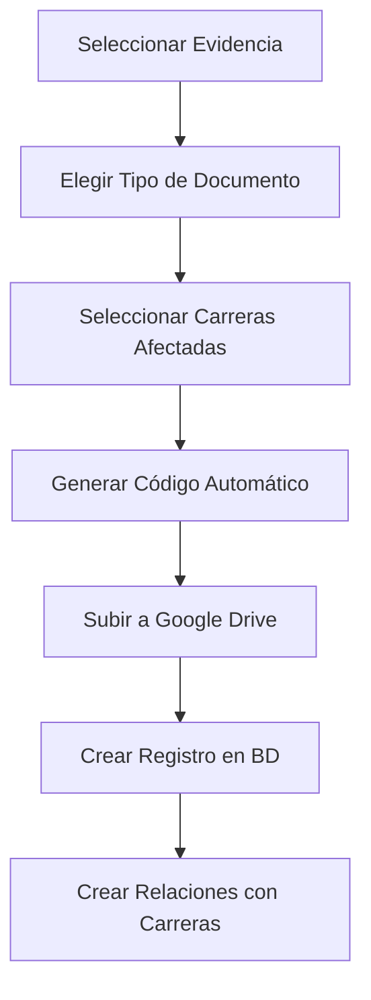
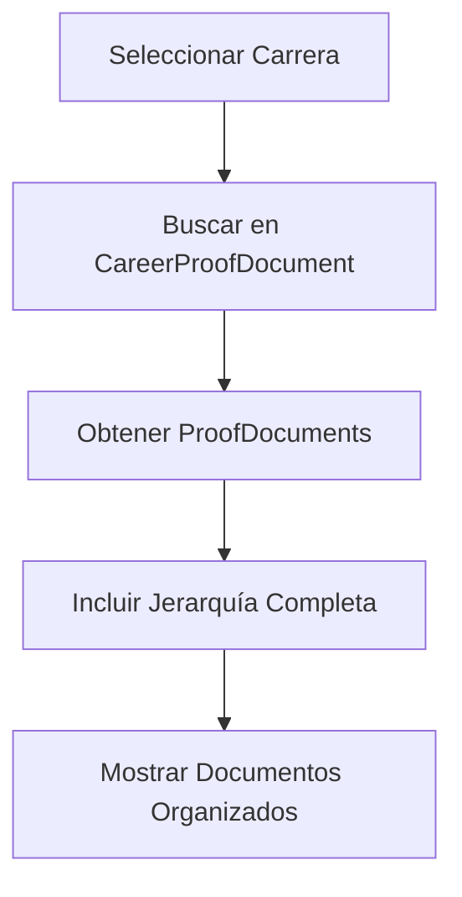
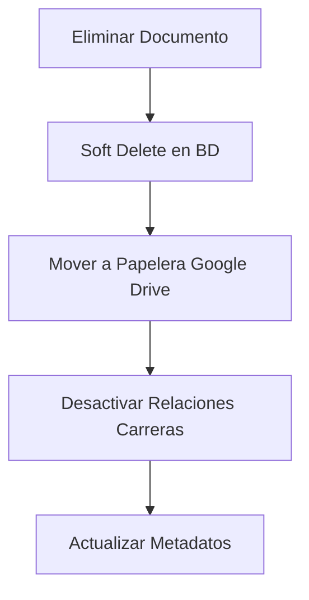

# 📋 Documentación Detallada del Sistema de Gestión de Calidad

## 🏗️ Arquitectura General del Sistema

El sistema está diseñado con una **arquitectura jerárquica** que sigue el estándar de gestión de calidad educativa:

```
Dimensión → Componente → Criterio → [Estándar] → Evidencia → Documento Probatorio
```

---

## 📊 1. Tabla: `Dimension`

### **Propósito General:**
Representa las **dimensiones principales** del sistema de gestión de calidad. Es el nivel más alto de la jerarquía y agrupa componentes relacionados temáticamente.

### **Campos Detallados:**

| Campo | Tipo | Función Específica |
|-------|------|-------------------|
| `id` | String (ObjectId) | **Identificador único** generado automáticamente por MongoDB |
| `version` | Int | **Control de concurrencia** para operaciones simultáneas (incrementa en cada actualización) |
| `code` | String (unique) | **Código único identificador** (ej: "DIM-1", "DIM-2") para referencias humanas |
| `name` | String | **Nombre descriptivo** de la dimensión (ej: "Relación con el contexto") |
| `description` | String? | **Descripción extendida** opcional que explica el alcance de la dimensión |
| `order` | Int | **Orden de presentación** para mantener secuencia lógica en interfaces |
| `status` | Status (enum) | **Estado del registro** (ACTIVE/INACTIVE) para soft delete |
| `createdAt` | DateTime | **Timestamp de creación** automático |
| `updatedAt` | DateTime | **Timestamp de última modificación** automático |
| `createdBy` | String? | **ID del usuario creador** para auditoría |
| `updatedBy` | String? | **ID del último usuario que modificó** para auditoría |

### **Relaciones:**
- **1:N con Component**: Una dimensión puede tener múltiples componentes
- **Cascada**: Al eliminar una dimensión, se afectan todos sus componentes

### **Ejemplo de Datos:**
```json
{
  "code": "DIM-1",
  "name": "Relación con el contexto",
  "description": "Dimensión que evalúa la relación de la carrera con su entorno",
  "order": 1
}
```

---

## 📊 2. Tabla: `Component`

### **Propósito General:**
Representa los **componentes** dentro de cada dimensión. Cada componente agrupa criterios relacionados funcionalmente.

### **Campos Detallados:**

| Campo | Tipo | Función Específica |
|-------|------|-------------------|
| `id` | String (ObjectId) | **Identificador único** del componente |
| `version` | Int | **Control de concurrencia** |
| `code` | String (unique) | **Código único** (ej: "COMP-1.1", "COMP-1.2") |
| `name` | String | **Nombre del componente** (ej: "Información y promoción") |
| `description` | String? | **Descripción detallada** del componente |
| `order` | Int | **Orden dentro de la dimensión** |
| `dimensionId` | String (ObjectId) | **Clave foránea** que vincula con la dimensión padre |
| `status` | Status | **Estado del registro** |
| Campos de auditoría | ... | **Misma función que en Dimension** |

### **Relaciones:**
- **N:1 con Dimension**: Pertenece a una dimensión específica
- **1:N con Criterion**: Un componente puede tener múltiples criterios

### **Ejemplo de Datos:**
```json
{
  "code": "COMP-1.1",
  "name": "Información y promoción",
  "description": "Gestión de información pública sobre la carrera",
  "order": 1,
  "dimensionId": "66c4a1b8f1234567890abcde"
}
```

---

## 📊 3. Tabla: `Criterion`

### **Propósito General:**
Define los **criterios específicos** de evaluación. **INNOVACIÓN CLAVE**: Puede tener estándares opcionales Y evidencias directas.

### **Campos Detallados:**

| Campo | Tipo | Función Específica |
|-------|------|-------------------|
| `id` | String (ObjectId) | **Identificador único** del criterio |
| `code` | String (unique) | **Código único** (ej: "CRIT-1.1.1") |
| `name` | String | **Nombre del criterio** |
| `description` | String? | **Descripción detallada** del criterio |
| `order` | Int | **Orden dentro del componente** |
| `componentId` | String (ObjectId) | **Clave foránea** al componente padre |

### **Relaciones ESPECIALES:**
- **N:1 con Component**: Pertenece a un componente
- **1:N con Standard**: Puede tener estándares **OPCIONALES**
- **1:N con QualityEvidence**: Puede tener evidencias **DIRECTAS** (cuando no hay estándares)

### **Casos de Uso:**
1. **Con Estándares**: `Criterion → Standard → Evidence → Document`
2. **Sin Estándares**: `Criterion → Evidence → Document`

### **Ejemplo de Datos:**
```json
{
  "code": "CRIT-1.1.1",
  "name": "Acceso público a información",
  "description": "Debe contarse con medios que permitan acceso público a información sobre la carrera",
  "order": 1,
  "componentId": "66c4a1b8f1234567890abcdf"
}
```

---

## 📊 4. Tabla: `Standard`

### **Propósito General:**
Define **estándares específicos** dentro de criterios. Son **OPCIONALES** - algunos criterios pueden no tenerlos.

### **Campos Detallados:**

| Campo | Tipo | Función Específica |
|-------|------|-------------------|
| `criterionId` | String (ObjectId) | **Clave foránea** al criterio padre |
| **Resto de campos** | ... | **Misma estructura que otros niveles** |

### **Relaciones:**
- **N:1 con Criterion**: Pertenece a un criterio específico
- **1:N con QualityEvidence**: Un estándar puede tener múltiples evidencias

### **Ejemplo de Datos:**
```json
{
  "code": "STD-1.1.1.1",
  "name": "Material informativo mínimo",
  "description": "La carrera debe contar al menos con un material informativo",
  "order": 1,
  "criterionId": "66c4a1b8f1234567890abce0"
}
```

---

## 📊 5. Tabla: `QualityEvidence` (¡TABLA CLAVE!)

### **Propósito General:**
Representa las **evidencias** que demuestran cumplimiento. **INNOVACIÓN**: Puede relacionarse con Standard O Criterion directamente.

### **Campos Detallados:**

| Campo | Tipo | Función Específica |
|-------|------|-------------------|
| `standardId` | String? (ObjectId) | **OPCIONAL** - ID del estándar padre (si existe) |
| `criterionId` | String? (ObjectId) | **OPCIONAL** - ID del criterio padre (evidencia directa) |
| `code` | String (unique) | **Código único** de la evidencia |
| `name` | String | **Nombre de la evidencia** |
| `description` | String | **Descripción OBLIGATORIA** de qué debe demostrar |
| `order` | Int | **Orden dentro del estándar/criterio** |

### **Lógica de Relaciones:**
```typescript
// Solo UNO de estos puede estar presente:
if (standardId !== null) {
  // Evidencia pertenece a un estándar
  criterionId = null;
} else if (criterionId !== null) {
  // Evidencia directa del criterio (no hay estándares)
  standardId = null;
}
```

### **Relaciones:**
- **N:1 con Standard** (opcional): Cuando la evidencia pertenece a un estándar
- **N:1 con Criterion** (opcional): Cuando la evidencia es directa del criterio
- **1:N con ProofDocument**: Una evidencia puede tener múltiples documentos probatorios

### **Ejemplo de Datos:**
```json
// Evidencia de un estándar
{
  "code": "EVID-1.1.1.1.1",
  "name": "Lista descriptiva de materiales informativos",
  "description": "Lista descriptiva de los materiales informativos disponibles...",
  "order": 1,
  "standardId": "66c4a1b8f1234567890abce1",
  "criterionId": null
}

// Evidencia directa de criterio
{
  "code": "EVID-1.1.1.1",
  "name": "Acceso a información",
  "description": "Evidencia directa de acceso público a información",
  "order": 1,
  "standardId": null,
  "criterionId": "66c4a1b8f1234567890abce0"
}
```

---

## 📊 6. Tabla: `ProofDocumentType`

### **Propósito General:**
Define **tipos reutilizables** de documentos probatorios que pueden usarse en múltiples evidencias.

### **Campos Detallados:**

| Campo | Tipo | Función Específica |
|-------|------|-------------------|
| `code` | String (unique) | **Código único del tipo** (ej: "CONV-01", "BROSHO-01") |
| `name` | String | **Nombre del tipo** (ej: "Convenio", "Brochure") |
| `description` | String? | **Descripción del tipo** de documento |
| `prefix` | String | **Prefijo para generación automática** de códigos (ej: "CONV", "BROSHO") |

### **Relaciones:**
- **1:N con ProofDocument**: Un tipo puede tener múltiples documentos
- **1:1 con DocumentCounter**: Cada tipo tiene su contador automático

### **Función de Generación Automática:**
```typescript
// Genera códigos como: CONV-001, CONV-002, BROSHO-001, etc.
const newCode = `${prefix}-${counter.toString().padStart(3, '0')}`;
```

### **Ejemplo de Datos:**
```json
{
  "code": "CONV-01",
  "name": "Convenio",
  "description": "Documentos de convenios institucionales",
  "prefix": "CONV"
}
```

---

## 📊 7. Tabla: `ProofDocument` (¡TABLA CENTRAL!)

### **Propósito General:**
Almacena los **documentos probatorios físicos** (PDF, Word, etc.) con metadatos completos de Google Drive.

### **Campos Detallados:**

| Campo | Tipo | Función Específica |
|-------|------|-------------------|
| `code` | String (unique) | **Código auto-generado** (ej: "CONV-001") |
| `name` | String | **Nombre descriptivo** del documento |
| `description` | String? | **Descripción opcional** del contenido |
| `fileUrl` | String | **URL pública de Google Drive** para acceso directo |
| `fileName` | String | **Nombre del archivo** físico |
| `fileType` | String | **Extensión del archivo** (pdf, docx, xlsx, etc.) |
| `fileSize` | Int? | **Tamaño en bytes** del archivo |
| `evidenceId` | String (ObjectId) | **Clave foránea** a la evidencia que soporta |
| `proofDocumentTypeId` | String (ObjectId) | **Clave foránea** al tipo de documento |

### **Metadatos de Google Drive:**

| Campo | Tipo | Función Específica |
|-------|------|-------------------|
| `googleDriveFileId` | String? | **ID único en Google Drive** para operaciones API |
| `googleDriveFolderId` | String? | **ID de la carpeta padre** en Google Drive |
| `googleDriveVersion` | String? | **Control de versiones** para sincronización |

### **Relaciones:**
- **N:1 con QualityEvidence**: Pertenece a una evidencia específica
- **N:1 con ProofDocumentType**: Tiene un tipo específico
- **N:M con Career**: Un documento puede afectar múltiples carreras (vía CareerProofDocument)

### **Ejemplo de Datos:**
```json
{
  "code": "CONV-001",
  "name": "Convenio con Universidad XYZ",
  "description": "Convenio de cooperación académica e investigación",
  "fileUrl": "https://drive.google.com/file/d/1ABC123.../view",
  "fileName": "convenio-universidad-xyz.pdf",
  "fileType": "pdf",
  "fileSize": 1048576,
  "evidenceId": "66c4a1b8f1234567890abce2",
  "proofDocumentTypeId": "66c4a1b8f1234567890abce3",
  "googleDriveFileId": "1ABC123DEF456GHI789JKL",
  "googleDriveFolderId": "1XYZ789ABC123DEF456GHI",
  "googleDriveVersion": "v1.0"
}
```

---

## 📊 8. Tabla: `CareerProofDocument` (¡RELACIÓN MANY-TO-MANY!)

### **Propósito General:**
Tabla de **relación many-to-many** que permite que un documento probatorio afecte múltiples carreras.

### **Campos Detallados:**

| Campo | Tipo | Función Específica |
|-------|------|-------------------|
| `careerId` | String (ObjectId) | **ID de la carrera** afectada |
| `proofDocumentId` | String (ObjectId) | **ID del documento** probatorio |
| `status` | Status | **Estado de la relación** (permite desactivar sin eliminar) |

### **Restricciones:**
- **@@unique([careerId, proofDocumentId])**: Evita duplicación de relaciones

### **Casos de Uso:**
```typescript
// Un convenio que afecta 3 carreras
const documentId = "doc123";
const affectedCareers = ["ing-sistemas", "ing-civil", "medicina"];

// Se crean 3 registros en esta tabla
affectedCareers.forEach(careerId => {
  CareerProofDocument.create({
    careerId,
    proofDocumentId: documentId
  });
});
```

### **Relaciones:**
- **N:1 con Career**: Referencia a una carrera específica
- **N:1 con ProofDocument**: Referencia a un documento específico

---

## 📊 9. Tabla: `DocumentCounter`

### **Propósito General:**
Controla la **generación automática de códigos** únicos para documentos probatorios por tipo.

### **Campos Detallados:**

| Campo | Tipo | Función Específica |
|-------|------|-------------------|
| `proofDocumentTypeId` | String (unique) | **ID del tipo** de documento (uno por tipo) |
| `lastNumber` | Int (default: 0) | **Último número generado** para este tipo |

### **Lógica de Funcionamiento:**
```typescript
async function generateDocumentCode(typeId: string) {
  // 1. Buscar/crear contador para el tipo
  let counter = await DocumentCounter.findUnique({ where: { proofDocumentTypeId: typeId }});
  
  if (!counter) {
    counter = await DocumentCounter.create({
      proofDocumentTypeId: typeId,
      lastNumber: 0
    });
  }
  
  // 2. Incrementar contador
  const updated = await DocumentCounter.update({
    where: { id: counter.id },
    data: { lastNumber: counter.lastNumber + 1 }
  });
  
  // 3. Generar código con prefijo
  const type = await ProofDocumentType.findUnique({ where: { id: typeId }});
  return `${type.prefix}-${updated.lastNumber.toString().padStart(3, '0')}`;
  // Resultado: "CONV-001", "CONV-002", "BROSHO-001", etc.
}
```

### **Relaciones:**
- **1:1 con ProofDocumentType**: Cada tipo tiene exactamente un contador

---

## 📊 10. Tabla: `GoogleDriveFolder`

### **Propósito General:**
Gestiona la **estructura jerárquica de carpetas** en Google Drive que refleja la organización del sistema.

### **Campos Detallados:**

| Campo | Tipo | Función Específica |
|-------|------|-------------------|
| `name` | String | **Nombre de la carpeta** en Google Drive |
| `googleFolderId` | String (unique) | **ID único de Google Drive** para operaciones API |
| `parentFolderId` | String? | **ID de la carpeta padre** en nuestro sistema (auto-referencia) |
| `level` | Int | **Nivel jerárquico** (1=Dimensión, 2=Componente, 3=Criterio, 4=Estándar, 5=Evidencia) |
| `entityType` | String | **Tipo de entidad** ("dimension", "component", "criterion", "standard", "evidence") |
| `entityId` | String? | **ID de la entidad** correspondiente en nuestro sistema |
| `careerCode` | String? | **Código de carrera** para carpetas específicas por carrera |
| `path` | String | **Ruta completa** en Google Drive para navegación |

### **Estructura Jerárquica:**
```
📁 /DIM-1_Relacion-contexto/                    (level: 1, entityType: "dimension")
└── 📁 COMP-1.1_Informacion-promocion/          (level: 2, entityType: "component")
    └── 📁 CRIT-1.1.1_Acceso-publico/           (level: 3, entityType: "criterion")
        └── 📁 STD-1.1.1.1_Material-info/       (level: 4, entityType: "standard")
            └── 📁 EVID-1.1.1.1.1_Lista-mat/    (level: 5, entityType: "evidence")
                ├── 📁 Carreras/
                │   ├── 📁 ING-SISTEMAS/         (careerCode: "ING-SISTEMAS")
                │   └── 📁 ING-CIVIL/            (careerCode: "ING-CIVIL")
                └── 📁 Compartidos/
```

### **Relaciones Auto-Referenciales:**
- **N:1 con GoogleDriveFolder** (padre): Una carpeta puede tener una carpeta padre
- **1:N con GoogleDriveFolder** (hijos): Una carpeta puede tener múltiples carpetas hijas

### **Funciones Especiales:**
- **onDelete: NoAction, onUpdate: NoAction**: Evita eliminación en cascada accidental
- **Sincronización**: Mantiene coherencia entre BD y Google Drive

---

## 🔄 Flujos de Operación del Sistema

### **1. Creación de Documento Probatorio:**


### **2. Consulta por Carrera:**


### **3. Eliminación Coordinada:**


---

## 📈 Ventajas del Diseño

### **1. Flexibilidad:**
- ✅ Criterios con/sin estándares
- ✅ Evidencias directas o por estándares
- ✅ Documentos reutilizables entre carreras

### **2. Escalabilidad:**
- ✅ Agregar nuevas carreras fácilmente
- ✅ Nuevos tipos de documentos
- ✅ Jerarquías más profundas si es necesario

### **3. Trazabilidad:**
- ✅ Auditoría completa de cambios
- ✅ Control de versiones
- ✅ Sincronización BD-Google Drive

### **4. Mantenimiento:**
- ✅ Soft delete para recuperación
- ✅ Operaciones atómicas
- ✅ Integridad referencial

Esta arquitectura proporciona una base sólida y flexible para gestionar todo el sistema de calidad educativa con máxima eficiencia y organización.
