# 🗺️ Diagrama de Relaciones del Sistema

## 📊 Mapa Completo de Relaciones

```mermaid
erDiagram
    Dimension ||--o{ Component : "1:N"
    Component ||--o{ Criterion : "1:N"
    Criterion ||--o{ Standard : "1:N (opcional)"
    Criterion ||--o{ QualityEvidence : "1:N (directo)"
    Standard ||--o{ QualityEvidence : "1:N"
    QualityEvidence ||--o{ ProofDocument : "1:N"
    ProofDocumentType ||--o{ ProofDocument : "1:N"
    ProofDocumentType ||--|| DocumentCounter : "1:1"
    ProofDocument ||--o{ CareerProofDocument : "1:N"
    Career ||--o{ CareerProofDocument : "1:N"
    GoogleDriveFolder ||--o{ GoogleDriveFolder : "1:N (auto-referencia)"

    Dimension {
        string id PK
        string code UK
        string name
        string description
        int order
        enum status
        datetime createdAt
        datetime updatedAt
        string createdBy
        string updatedBy
    }

    Component {
        string id PK
        string code UK
        string name
        string description
        int order
        string dimensionId FK
        enum status
        datetime createdAt
        datetime updatedAt
        string createdBy
        string updatedBy
    }

    Criterion {
        string id PK
        string code UK
        string name
        string description
        int order
        string componentId FK
        enum status
        datetime createdAt
        datetime updatedAt
        string createdBy
        string updatedBy
    }

    Standard {
        string id PK
        string code UK
        string name
        string description
        int order
        string criterionId FK
        enum status
        datetime createdAt
        datetime updatedAt
        string createdBy
        string updatedBy
    }

    QualityEvidence {
        string id PK
        string code UK
        string name
        string description
        int order
        string standardId FK "OPCIONAL"
        string criterionId FK "OPCIONAL"
        enum status
        datetime createdAt
        datetime updatedAt
        string createdBy
        string updatedBy
    }

    ProofDocumentType {
        string id PK
        string code UK
        string name
        string description
        string prefix
        enum status
        datetime createdAt
        datetime updatedAt
        string createdBy
        string updatedBy
    }

    ProofDocument {
        string id PK
        string code UK "AUTO-GENERADO"
        string name
        string description
        string fileUrl
        string fileName
        string fileType
        int fileSize
        string evidenceId FK
        string proofDocumentTypeId FK
        string googleDriveFileId
        string googleDriveFolderId
        string googleDriveVersion
        enum status
        datetime createdAt
        datetime updatedAt
        string createdBy
        string updatedBy
    }

    CareerProofDocument {
        string id PK
        string careerId FK
        string proofDocumentId FK
        enum status
        datetime createdAt
        datetime updatedAt
        string createdBy
        string updatedBy
    }

    Career {
        string id PK
        string code
        string name
        string schoolId FK
        enum status
        datetime createdAt
        datetime updatedAt
        string createdBy
        string updatedBy
    }

    DocumentCounter {
        string id PK
        string proofDocumentTypeId FK "UNIQUE"
        int lastNumber
        datetime createdAt
        datetime updatedAt
    }

    GoogleDriveFolder {
        string id PK
        string name
        string googleFolderId UK
        string parentFolderId FK "SELF-REF"
        int level
        string entityType
        string entityId
        string careerCode
        string path
        enum status
        datetime createdAt
        datetime updatedAt
        string createdBy
        string updatedBy
    }
```



---

## 🔄 Flujos de Datos Principales

### **1. Flujo de Creación Jerárquica:**
```
┌─────────────┐    ┌─────────────┐    ┌─────────────┐
│ Dimension   │───▶│ Component   │───▶│ Criterion   │
│ DIM-1       │    │ COMP-1.1    │    │ CRIT-1.1.1  │
└─────────────┘    └─────────────┘    └─────────────┘
                                             │
                                             ▼
                                    ┌─────────────────┐
                                    │ ¿Tiene          │
                                    │ Estándares?     │
                                    └─────────────────┘
                                           │
                              ┌────────────┴────────────┐
                              ▼                         ▼
                    ┌─────────────┐           ┌─────────────┐
                    │ Standard    │           │ Evidence    │
                    │ STD-1.1.1.1 │           │ (Directa)   │
                    └─────────────┘           └─────────────┘
                              │                         │
                              ▼                         │
                    ┌─────────────┐                     │
                    │ Evidence    │◀────────────────────┘
                    │ EVID-...    │
                    └─────────────┘
                              │
                              ▼
                    ┌─────────────┐
                    │ ProofDoc    │
                    │ CONV-001    │
                    └─────────────┘
```

### **2. Flujo de Documentos Multi-Carrera:**
```
┌─────────────────┐
│ ProofDocument   │
│ CONV-001        │
└─────────────────┘
          │
          ▼
┌─────────────────┐
│CareerProofDoc   │
│ (Relación M:N)  │
└─────────────────┘
          │
    ┌─────┴─────┬─────────┐
    ▼           ▼         ▼
┌─────────┐ ┌─────────┐ ┌─────────┐
│ Carrera │ │ Carrera │ │ Carrera │
│ Ing-Sis │ │ Ing-Civ │ │ Medicina│
└─────────┘ └─────────┘ └─────────┘
```

### **3. Flujo de Google Drive:**
```
┌─────────────────┐
│ Crear Documento │
└─────────────────┘
          │
          ▼
┌─────────────────┐    ┌─────────────────┐
│ Generar Código  │───▶│ Buscar Carpeta  │
│ CONV-001        │    │ en Drive        │
└─────────────────┘    └─────────────────┘
          │                       │
          ▼                       ▼
┌─────────────────┐    ┌─────────────────┐
│ Subir Archivo   │◀───│ Determinar      │
│ a Google Drive  │    │ Carpeta Destino │
└─────────────────┘    └─────────────────┘
          │
          ▼
┌─────────────────┐
│ Guardar         │
│ Metadatos en BD │
└─────────────────┘
```

---

## 📍 Puntos Clave de Integración

### **1. QualityEvidence - Punto Central:**
```sql
-- Evidencia de un estándar
SELECT * FROM QualityEvidence 
WHERE standardId IS NOT NULL AND criterionId IS NULL;

-- Evidencia directa de criterio
SELECT * FROM QualityEvidence 
WHERE standardId IS NULL AND criterionId IS NOT NULL;
```

### **2. Generación de Códigos:**
```typescript
// Proceso automático
const type = await ProofDocumentType.findUnique({id: typeId});
const counter = await DocumentCounter.findUnique({proofDocumentTypeId: typeId});
const newCode = `${type.prefix}-${(counter.lastNumber + 1).toString().padStart(3, '0')}`;
// Resultado: "CONV-001", "BROSHO-002", etc.
```

### **3. Consultas por Carrera:**
```sql
-- Todos los documentos de una carrera
SELECT pd.*, qe.name as evidence_name, 
       s.name as standard_name, c.name as criterion_name
FROM CareerProofDocument cpd
JOIN ProofDocument pd ON cpd.proofDocumentId = pd.id
JOIN QualityEvidence qe ON pd.evidenceId = qe.id
LEFT JOIN Standard s ON qe.standardId = s.id
LEFT JOIN Criterion c ON (qe.criterionId = c.id OR s.criterionId = c.id)
WHERE cpd.careerId = 'carrera-id'
AND cpd.status = 'ACTIVE';
```

---

## 🛡️ Reglas de Integridad

### **1. QualityEvidence - Validación:**
```typescript
// REGLA: Una evidencia DEBE tener standardId O criterionId, no ambos
function validateEvidence(evidence: QualityEvidence) {
  const hasStandard = evidence.standardId !== null;
  const hasCriterion = evidence.criterionId !== null;
  
  if (hasStandard && hasCriterion) {
    throw new Error("Evidence cannot belong to both Standard and Criterion");
  }
  
  if (!hasStandard && !hasCriterion) {
    throw new Error("Evidence must belong to either Standard or Criterion");
  }
}
```

### **2. CareerProofDocument - Unicidad:**
```sql
-- CONSTRAINT: Un documento no puede estar asociado dos veces a la misma carrera
UNIQUE(careerId, proofDocumentId)
```

### **3. DocumentCounter - Atomicidad:**
```typescript
// TRANSACCIÓN: Generar código e incrementar contador de forma atómica
async function generateCodeSafely(typeId: string) {
  return await prisma.$transaction(async (tx) => {
    const counter = await tx.documentCounter.update({
      where: { proofDocumentTypeId: typeId },
      data: { lastNumber: { increment: 1 } }
    });
    
    const type = await tx.proofDocumentType.findUnique({
      where: { id: typeId }
    });
    
    return `${type.prefix}-${counter.lastNumber.toString().padStart(3, '0')}`;
  });
}
```

---

## 🎯 Casos de Uso Específicos

### **1. Documento que Afecta 3 Carreras:**
```typescript
// Crear documento
const document = await createProofDocument({
  name: "Convenio Universidad XYZ",
  evidenceId: "evidence123",
  typeId: "convenio-type"
});

// Asociar con múltiples carreras
const careers = ["ing-sistemas", "ing-civil", "medicina"];
await Promise.all(
  careers.map(careerId => 
    createCareerProofDocument({
      careerId,
      proofDocumentId: document.id
    })
  )
);
```

### **2. Criterio Sin Estándares:**
```typescript
// Crear criterio
const criterion = await createCriterion({
  code: "CRIT-1.1.1",
  name: "Acceso público a información",
  componentId: "comp123"
});

// Crear evidencia directa (sin estándar)
const evidence = await createQualityEvidence({
  code: "EVID-1.1.1.1",
  name: "Lista de materiales informativos",
  criterionId: criterion.id,
  standardId: null // Sin estándar
});
```

### **3. Búsqueda Jerárquica Completa:**
```typescript
// Obtener todo el árbol de una dimensión
const fullHierarchy = await prisma.dimension.findUnique({
  where: { id: dimensionId },
  include: {
    components: {
      include: {
        criteria: {
          include: {
            standards: {
              include: {
                evidences: {
                  include: {
                    proofDocuments: {
                      include: {
                        careerProofDocuments: {
                          include: { career: true }
                        }
                      }
                    }
                  }
                }
              }
            },
            evidences: { // Evidencias directas
              include: {
                proofDocuments: {
                  include: {
                    careerProofDocuments: {
                      include: { career: true }
                    }
                  }
                }
              }
            }
          }
        }
      }
    }
  }
});
```

Esta documentación proporciona una visión completa y detallada de cada tabla, sus relaciones y funciones específicas en el sistema de gestión de calidad.
